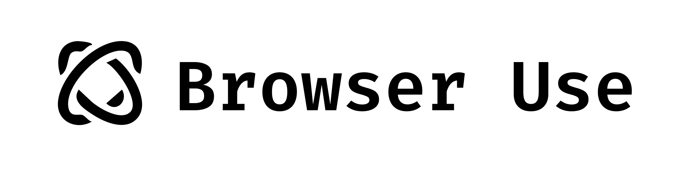

<picture>
  <source media="(prefers-color-scheme: dark)" srcset="./static/browser-use-dark.png">
  <source media="(prefers-color-scheme: light)" srcset="./static/browser-use.png">
  
</picture>

<h1 align="center">USE IT — Enable AI to control your browser</h1>

> **Note:** This repository is maintained as **USE IT**, a renamed fork of the original [browser-use/browser-use](https://github.com/browser-use/browser-use). Our fork lives at [Mega-Gorilla/USE-IT](https://github.com/Mega-Gorilla/USE-IT). We keep core functionality while providing a simplified setup (local Chromium bootstrap, minimal documentation) tailored for our environment and avoid naming conflicts with the upstream project.

English | [日本語](#日本語-japanese)


# 🤖 Quickstart (English)

Clone this fork and install from source (Python >= 3.11):

```bash
git clone https://github.com/Mega-Gorilla/USE-IT.git
cd USE-IT
uv sync --all-extras --dev  # or: python -m venv .venv && source .venv/bin/activate && pip install -e .
uvx playwright install chromium
cp config.yaml.example config.yaml  # add your API keys or rely on environment variables
```

Run your first agent from the project root:

```python
from browser_use import Agent, ChatGoogle
from browser_use.agent.config import AgentConfig

config = AgentConfig(
    task="Find the number of stars of the USE-IT repo",
    llm=ChatGoogle(model="gemini-flash-latest"),
    # browser=Browser(use_cloud=True),  # Uses Browser-Use cloud for the browser
)
agent = Agent(config=config)
agent.run_sync()
```

Check out the [library docs](https://docs.browser-use.com) and [cloud docs](https://docs.cloud.browser-use.com) for more settings.

## Local development from source

Clone the repo and run the bootstrap script to prepare the virtual environment and local Playwright browser cache:

```bash
./bin/bootstrap_chromium.sh
```

The script will:
- create `.venv` if missing,
- install the package in editable mode and ensure the Playwright CLI is available,
- download Chromium/FFmpeg/Headless Shell into `.playwright-browsers/`, the path shared by our tooling via `PLAYWRIGHT_BROWSERS_PATH`.

If you prefer manual setup:

```bash
python3 -m venv .venv
source .venv/bin/activate
pip install -e .
pip install playwright
PLAYWRIGHT_BROWSERS_PATH=.playwright-browsers playwright install chromium
```

Either path keeps large browser binaries out of Git while guaranteeing consistent local behaviour.


# 日本語 (Japanese)

> **注意:** このリポジトリは [browser-use/browser-use](https://github.com/browser-use/browser-use) のフォークをリネームした **USE IT** です。現在のフォークは [Mega-Gorilla/USE-IT](https://github.com/Mega-Gorilla/USE-IT) で公開しています。オリジナルから主要機能を引き継ぎつつ、名称の混同を避けるために改名し、ローカル開発向けセットアップ（Chromium ブートストラップや簡潔なドキュメント）を追加しています。

## クイックスタート

このフォークからソースインストールします（Python 3.11 以上）:

```bash
git clone https://github.com/Mega-Gorilla/USE-IT.git
cd USE-IT
uv sync --all-extras --dev  # もしくは: python -m venv .venv && source .venv/bin/activate && pip install -e .
uvx playwright install chromium
cp config.yaml.example config.yaml  # APIキーを設定（もしくは環境変数を利用）
```

サンプルコード（リポジトリ直下で実行）:

```python
from browser_use import Agent, ChatGoogle
from browser_use.agent.config import AgentConfig

config = AgentConfig(
    task="USE IT レポジトリのスター数を確認する",
    llm=ChatGoogle(model="gemini-flash-latest"),
)
agent = Agent(config=config)
agent.run_sync()
```

## リポジトリから開発する場合

次のスクリプトで仮想環境と Playwright のブラウザキャッシュをまとめて準備できます:

```bash
./bin/bootstrap_chromium.sh
```

スクリプトの処理内容:
- `.venv` が無ければ作成
- パッケージを編集可能インストールし、Playwright CLI を導入
- Chromium / FFmpeg / Headless Shell を `.playwright-browsers/` にダウンロード（`PLAYWRIGHT_BROWSERS_PATH` で共有）

手動で行う場合は次のとおりです:

```bash
python3 -m venv .venv
source .venv/bin/activate
pip install -e .
pip install playwright
PLAYWRIGHT_BROWSERS_PATH=.playwright-browsers playwright install chromium
```

Git にはブラウザのバイナリを含めず、ローカルでのみ共有する構成になっています。
