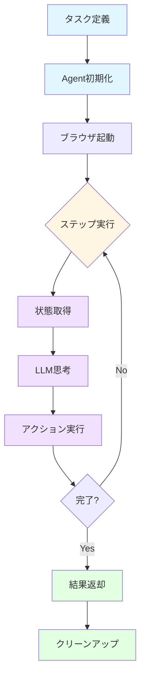

# Agent - ブラウザ自動化AIエージェント

browser-useの`Agent`は、LLMの力を利用してブラウザを自律的に操作する中核コンポーネントです。このディレクトリには、Agentの内部動作、設計思想、実装の詳細に関するドキュメントが含まれています。

## 概要

Agentは以下の機能を提供します：

```python
from browser_use import Agent

agent = Agent(
    task="Wikipedia で Python について調べて、主要な特徴を3つ教えて",
    llm=my_llm
)

result = agent.run_sync()
print(result.final_result())
```

### 主要な特徴

| 特徴 | 説明 |
|------|------|
| **🤖 自律動作** | タスクを与えるだけで、必要なステップを自動的に計画・実行 |
| **👁️ ビジョン対応** | スクリーンショットを使って視覚的な要素を理解 |
| **🔄 適応的実行** | 失敗時の自動リトライ、動的なアクション選択 |
| **📊 完全な履歴** | すべてのステップ、思考、結果を記録 |
| **🛠️ 拡張可能** | カスタムツール、アクション、LLMを簡単に追加 |
| **☁️ クラウド連携** | オプションでテレメトリとクラウド同期をサポート |

## 主要な概念

### Agentのライフサイクル



### アーキテクチャの4つの柱

#### 1. **LLM統合**
- 複数のLLMプロバイダーをサポート（OpenAI, Anthropic, Google, Groq等）
- 構造化出力（structured output）による確実なアクション抽出
- トークン使用量の自動追跡

#### 2. **ブラウザ制御**
- CDP（Chrome DevTools Protocol）による低レベル制御
- 複数タブ・ウィンドウの管理
- セッション永続化とプロファイル管理

#### 3. **ツールシステム**
- 30以上の組み込みアクション（click, type, scroll, navigate等）
- カスタムツールの簡単な追加
- アクション結果の構造化

#### 4. **状態管理**
- DOM状態の効率的な取得と処理
- 履歴とコンテキストの最適化
- ワークスペースとファイルシステムの管理

## クイックスタート

### 基本的な使い方

```python
from browser_use import Agent
from langchain_openai import ChatOpenAI

# LLMの準備
llm = ChatOpenAI(model="gpt-4o")

# Agentの作成と実行
agent = Agent(
    task="GitHubで browser-use リポジトリを検索して、スター数を教えて",
    llm=llm
)

result = agent.run_sync()
print(result.final_result())
```

### 高度な設定

```python
from browser_use import Agent, BrowserSession

# カスタムブラウザセッション
browser = BrowserSession(
    headless=False,  # UIを表示
    keep_alive=True  # ブラウザを維持
)

# 詳細な設定でAgent作成
agent = Agent(
    task="複雑なタスク",
    llm=llm,
    browser_session=browser,
    max_steps=50,           # 最大ステップ数
    use_vision=True,        # スクリーンショットを使用
    max_failures=3,         # 失敗許容回数
)

# 非同期実行
result = await agent.run()

# 詳細な結果確認
print(f"完了: {result.is_done()}")
print(f"ステップ数: {len(result.history)}")
print(f"使用トークン: {result.total_tokens}")
```

## ドキュメント一覧

### 📚 利用可能なドキュメント

| ドキュメント | 説明 | 対象者 |
|------------|------|--------|
| **[agent_flow.md](./agent_flow.md)** | Agent実行フローの詳細解説。初期化からクリーンアップまでの全フェーズを網羅 | すべての開発者 |

### 🚧 今後追加予定

以下のドキュメントは今後追加される予定です：

- **agent_architecture.md** - Agentの内部アーキテクチャ、各コンポーネントの詳細
- **agent_customization.md** - カスタムツール、システムプロンプト、フックの作成
- **agent_optimization.md** - パフォーマンス最適化、メモリ管理、トークン削減
- **agent_debugging.md** - デバッグテクニック、ログ分析、トラブルシューティング
- **agent_testing.md** - Agentのテスト戦略、モック、CI/CD統合
- **agent_patterns.md** - 実践的な使用パターン、ベストプラクティス

## 主要なAPIリファレンス

### Agent クラス

```python
class Agent:
    def __init__(
        self,
        task: str,
        llm: BaseChatModel,
        browser_session: BrowserSession | None = None,
        max_steps: int = 100,
        use_vision: bool = True,
        max_failures: int = 5,
        retry_delay: float = 1.0,
        system_prompt: str | None = None,
        # ... その他多数のオプション
    )

    async def run(self) -> AgentHistoryList:
        """Agent実行（非同期）"""

    def run_sync(self) -> AgentHistoryList:
        """Agent実行（同期）"""

    async def step(self) -> AgentStepInfo:
        """単一ステップの実行"""

    async def close(self) -> AgentHistoryList:
        """リソースのクリーンアップ"""
```

### AgentHistoryList

```python
class AgentHistoryList:
    history: list[AgentHistory]      # 実行履歴
    final_result: str | None         # 最終結果
    model_actions: list[ActionModel] # 実行されたアクション

    def is_done(self) -> bool:
        """タスクが完了したか"""

    def final_result(self) -> str:
        """最終結果を取得"""

    @property
    def total_tokens(self) -> int:
        """使用トークン総数"""
```

## 実用例

### 例1: 情報収集タスク

```python
# Wikipedia から情報を抽出
agent = Agent(
    task="Pythonの歴史について調べて、作成年と作者を教えて",
    llm=llm
)
result = agent.run_sync()
```

### 例2: フォーム入力タスク

```python
# Webフォームへの入力
agent = Agent(
    task="""
    https://example.com/contact にアクセスして、
    以下の情報で問い合わせフォームを送信：
    - 名前: テスト太郎
    - メール: test@example.com
    - 件名: テスト送信
    """,
    llm=llm
)
result = agent.run_sync()
```

### 例3: データスクレイピング

```python
# 複数ページからのデータ収集
agent = Agent(
    task="""
    Hacker News のトップページから、
    上位5つの記事のタイトルとスコアをJSON形式で抽出
    """,
    llm=llm,
    max_steps=20
)
result = agent.run_sync()
print(result.extracted_content)
```

### 例4: マルチステップワークフロー

```python
# 複雑なワークフロー
agent = Agent(
    task="""
    1. GitHub で browser-use を検索
    2. リポジトリのREADMEを読む
    3. 最新のissueを3つ確認
    4. それぞれの要約を作成
    """,
    llm=llm,
    max_steps=100,
    use_vision=True  # UIの理解に役立つ
)
result = agent.run_sync()

# ステップごとの詳細を確認
for i, step in enumerate(result.history, 1):
    print(f"\n--- Step {i} ---")
    print(f"思考: {step.state.thought}")
    print(f"アクション: {step.action}")
```

## パフォーマンスとベストプラクティス

### ⚡ パフォーマンス最適化

```python
# メモリとトークンを節約
agent = Agent(
    task="タスク",
    llm=llm,
    use_vision=False,           # スクリーンショット不要なら False
    max_history_messages=10,    # 履歴を制限
    max_steps=50,               # 無限ループを防ぐ
)
```

### 🎯 タスク設計のコツ

**良いタスク例:**
```python
task = """
1. https://example.com にアクセス
2. 検索ボックスに「Python」と入力
3. 最初の検索結果をクリック
4. ページのタイトルとURLを抽出
"""
```

**避けるべき例:**
```python
task = "何か面白いものを探して"  # ❌ 曖昧すぎる
```

### 🔒 セキュリティとプライバシー

```python
# プライバシーを考慮した設定
agent = Agent(
    task="タスク",
    llm=llm,
    browser_session=BrowserSession(
        headless=True,              # UIを表示しない
        disable_security=False,     # セキュリティ機能を有効化
        allowed_domains=[            # アクセス可能なドメインを制限
            "example.com",
            "trusted-site.com"
        ]
    )
)
```

## デバッグとトラブルシューティング

### ログレベルの設定

```bash
# 詳細なログを出力
export BROWSER_USE_LOGGING_LEVEL=debug
python script.py
```

### よくある問題と解決策

#### 問題1: タスクが完了しない

**原因**: `max_steps`に到達している

**解決策**:
```python
agent = Agent(task="...", llm=llm, max_steps=200)  # 増やす
```

#### 問題2: 要素が見つからない

**原因**: ページの読み込みタイミング

**解決策**:
```python
# ビジョンモードを有効化
agent = Agent(task="...", llm=llm, use_vision=True)
```

#### 問題3: メモリ使用量が多い

**原因**: 履歴の蓄積、スクリーンショット

**解決策**:
```python
agent = Agent(
    task="...",
    llm=llm,
    use_vision=False,
    max_history_messages=5
)
```

## 関連リソース

### 📖 その他のドキュメント

- [BrowserSession](../browser/session.md) - ブラウザセッション管理
- [Tools](../tools/README.md) - ツールとアクションシステム
- [DOM Processing](../dom/README.md) - DOM処理と最適化
- [LLM Integration](../llm/README.md) - LLM統合

### 🔗 外部リンク

- [公式ドキュメント](https://docs.browser-use.com)
- [GitHub リポジトリ](https://github.com/browser-use/browser-use)
- [サンプルコード](../../examples/)
- [テストケース](../../tests/ci/)

### 💬 コミュニティ

- [Discord](https://discord.gg/browser-use)
- [GitHub Discussions](https://github.com/browser-use/browser-use/discussions)
- [Issue Tracker](https://github.com/browser-use/browser-use/issues)

## 貢献

Agentの改善に貢献する方法：

1. **バグ報告**: [Issue](https://github.com/browser-use/browser-use/issues)を作成
2. **機能提案**: [Discussions](https://github.com/browser-use/browser-use/discussions)で議論
3. **コード貢献**: プルリクエストを送信
4. **ドキュメント**: typoの修正、説明の追加など

### 開発環境のセットアップ

```bash
# リポジトリのクローン
git clone https://github.com/browser-use/browser-use.git
cd browser-use

# 依存関係のインストール
uv venv --python 3.12
source .venv/bin/activate
uv sync --all-extras

# テストの実行
pytest tests/ci/ -v

# 型チェック
pyright

# リント/フォーマット
ruff check --fix
ruff format
```

## ライセンス

browser-useは[MITライセンス](../../LICENSE)の下で公開されています。

---

**最終更新**: 2025年10月14日
**バージョン**: 0.8.0
