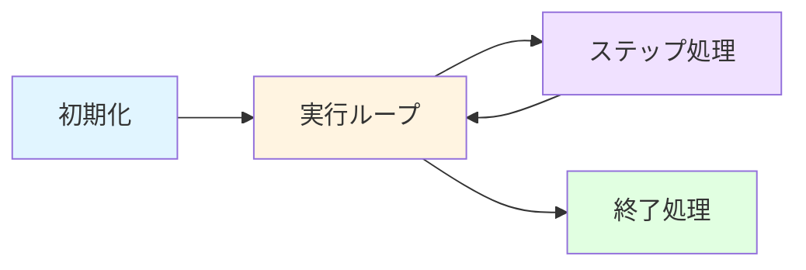
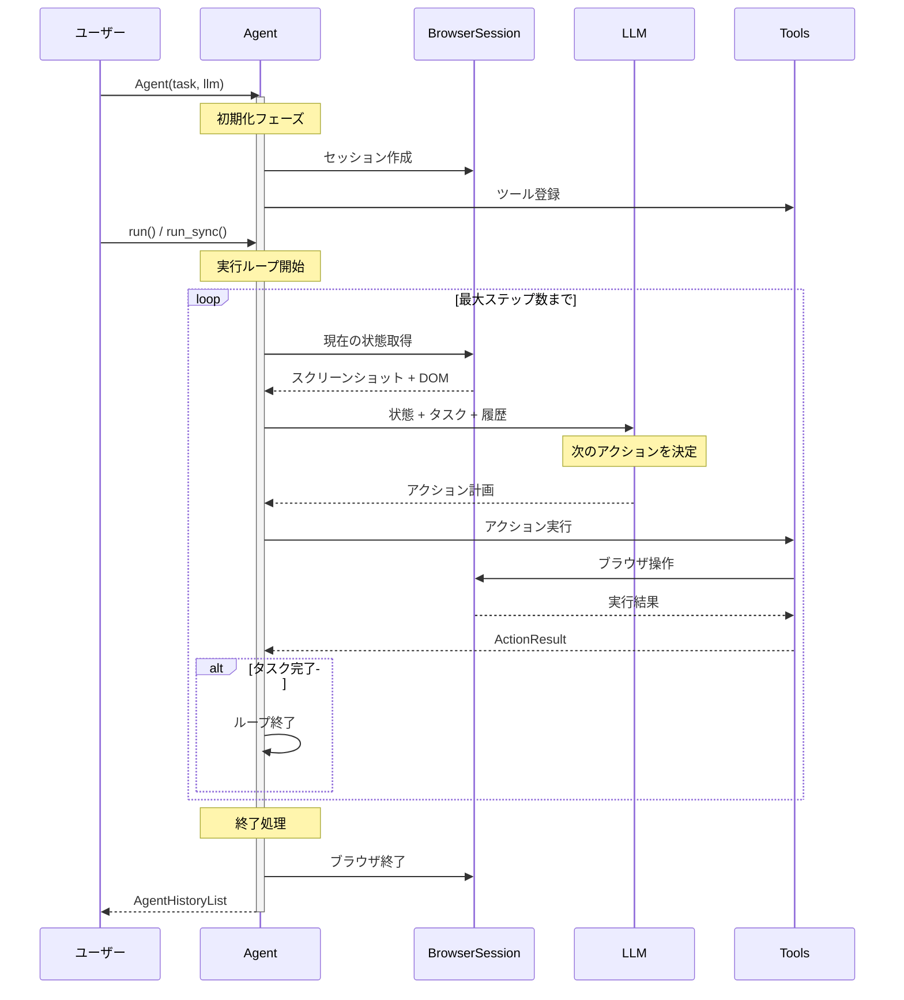

# Agent実行フローガイド

このドキュメントでは、browser-useの`Agent`がどのように動作するかを解説します。`agent.run()`を呼び出したとき、内部で何が起きているのかを理解することで、デバッグやカスタマイズがしやすくなります。

## 目次

- [クイックスタート](#クイックスタート)
- [全体アーキテクチャ](#全体アーキテクチャ)
- [詳細な実行フロー](#詳細な実行フロー)
- [各ステージの詳細](#各ステージの詳細)
- [よくある質問](#よくある質問)

## クイックスタート

最もシンプルなAgent使用例：

```python
from browser_use import Agent
from browser_use.agent.config import AgentConfig

# 1. Agentインスタンス作成（推奨: AgentConfigを使用）
config = AgentConfig(
    task="Wikipediaでブラウザ自動化について調べる",
    llm=my_llm  # ChatGoogle, ChatOpenAI, etc.
)
agent = Agent(config=config)

# または従来の方法も使用可能
agent = Agent(
    task="Wikipediaでブラウザ自動化について調べる",
    llm=my_llm
)

# 2. 実行（同期）
result = agent.run_sync()

# 3. 結果確認
print(result.final_result())
```

内部では以下のステップが自動的に実行されます：
1. ブラウザの起動
2. タスク分解と計画
3. ブラウザ操作の実行（クリック、入力、スクロールなど）
4. 情報の収集と整理
5. ブラウザの終了

## 全体アーキテクチャ

Agentの動作は大きく4つのフェーズに分かれます：



### フェーズ概要

| フェーズ | 主な処理 | 重要性 |
|---------|---------|--------|
| **初期化** | LLM設定、ブラウザセッション準備、ツール登録 | すべての基盤を整える |
| **実行ループ** | 最大ステップ数まで繰り返し実行 | タスク完了まで継続 |
| **ステップ処理** | 状態取得 → LLM思考 → アクション実行 | Agentの「思考」と「行動」 |
| **終了処理** | リソース解放、結果の整理 | クリーンアップ |

## 詳細な実行フロー



## 各ステージの詳細

### 1. 初期化フェーズ (`Agent.__init__`)

**場所**: `browser_use/agent/service.py` の `Agent.__init__()`

**何が起こるか:**

```python
# 方法1: AgentConfig を使用（推奨）
from browser_use.agent.config import AgentConfig

config = AgentConfig(
    task="タスク内容",
    llm=my_llm,
    browser_session=None,  # 未指定なら自動作成
    max_steps=100
)
agent = Agent(config=config)

# 方法2: 従来の方法（後方互換性あり）
agent = Agent(
    task="タスク内容",
    llm=my_llm,
    browser_session=None,
    max_steps=100
)
```

**内部処理（Phase 2リファクタリング後）:**

1. **AgentConfigの構築または受け入れ**
   - `config`が指定されていない場合、kwargsから`AgentConfig`を自動構築
   - 42個のパラメータを1つのdataclassに集約

2. **デフォルト値の解決** (`_resolve_defaults`)
   - LLMが指定されていない場合、デフォルト（`ChatGoogle`）を使用
   - 環境変数やCONFIGから自動検出
   - タイムアウト値、フラッシュモード等の解決

3. **コンポーネントの初期化** (ヘルパーメソッドに分割)
   - `_initialize_token_cost_service()`: LLM使用量の記録を開始
   - `_initialize_history_components()`: 履歴とステート管理の初期化
   - `_initialize_filesystem()`: ワークスペースとダウンロード追跡の準備

4. **ツールシステム構築** (`_prepare_tools`, `_setup_action_models`)
   - 利用可能なアクション（click, type, scroll等）を登録
   - カスタムツールがあれば追加
   - ページ固有のアクションモデルを動的生成

5. **専門マネージャーの作成**（Phase 1で分離）
   - `FilesystemManager`: ファイルシステムとダウンロード管理
   - `HistoryManager`: 履歴の作成・保存・再生
   - `LLMHandler`: LLM呼び出しとリトライロジック
   - `StepExecutor`: ステップ実行のコーディネーション
   - `TelemetryHandler`: ログ出力とテレメトリ
   - `PauseController`: 一時停止/再開の制御（Phase 2で分離）

6. **ファクトリーパターンによるDI** (`AgentFactories`)
   - テスト時に依存を簡単にモック化可能
   - `telemetry_factory`, `event_bus_factory`, `cloud_sync_factory`

**なぜ重要か:**
このフェーズで問題があると、後続のすべての処理が失敗します。デバッグ時は、まずこのフェーズのログを確認しましょう。Phase 2リファクタリングにより、初期化ロジックが8つのヘルパーメソッドに整理され、デバッグが容易になりました。

---

### 2. 実行ループ (`Agent.run` / `Agent.run_sync`)

**場所**:
- `browser_use/agent/service.py` の `run()` メソッド（エントリーポイント）
- `browser_use/agent/runner/service.py` の `AgentRunner.run()` （実装）

**同期版と非同期版:**

```python
# 非同期版（推奨）
result = await agent.run()

# 同期版（簡単だがブロッキング）
result = agent.run_sync()  # 内部で asyncio.run() を呼ぶ
```

**Phase 2リファクタリング: AgentRunnerへの委譲**

```python
# Agent.run() は AgentRunner に実行を委譲
async def run(
    self,
    max_steps: int = 100,
    on_step_start: AgentHookFunc | None = None,
    on_step_end: AgentHookFunc | None = None,
) -> AgentHistoryList:
    """Delegate execution to the AgentRunner."""
    return await AgentRunner(self).run(
        max_steps=max_steps,
        on_step_start=on_step_start,
        on_step_end=on_step_end,
    )
```

**内部処理（AgentRunner内）:**

```python
# browser_use/agent/runner/service.py
async def run(self, max_steps: int = 100, ...) -> AgentHistoryList:
    try:
        # 1. シグナルハンドラ登録（Ctrl+Cで一時停止/再開）
        signal_handler = SignalHandler(
            loop=loop,
            pause_callback=self.agent.pause,    # PauseController に委譲
            resume_callback=self.agent.resume,  # PauseController に委譲
            custom_exit_callback=on_force_exit_log_telemetry,
        )

        # 2. テレメトリ初期化
        await self.agent.telemetry_handler.log_agent_run()

        # 3. セッション初期化
        if not self.agent.state.session_initialized:
            await self._initialize_session()

        # 4. ブラウザ起動
        await self.agent.browser_session.start()

        # 5. 初期アクション実行（URLがあればナビゲート）
        await self.agent.step_executor.execute_initial_actions()

        # 6. メインループ
        for step in range(max_steps):
            # 一時停止処理
            await self._handle_pause(signal_handler, step)

            # 失敗チェック
            if self._should_stop_for_failures():
                break

            # フック: ステップ開始前
            if on_step_start:
                await on_step_start(self.agent)

            # ステップ実行（StepExecutor に委譲）
            await asyncio.wait_for(
                self.agent.step(step_info),
                timeout=self.agent.settings.step_timeout
            )

            # フック: ステップ完了後
            if on_step_end:
                await on_step_end(self.agent)

            # 完了判定
            if self.agent.history.is_done():
                await self._handle_completion()
                break

        # 7. 使用量サマリーの収集
        self.agent.history.usage = await self.agent.token_cost_service.get_usage_summary()

        return self.agent.history

    except Exception as e:
        # エラーハンドリング
        raise
    finally:
        # 8. クリーンアップ（必ず実行）
        await self._cleanup(signal_handler, max_steps, agent_run_error)
```

**Phase 2で追加された機能:**

1. **一時停止/再開** (`PauseController`)
   - Ctrl+C で一時停止、Enterで再開
   - `_handle_pause()` で状態確認

2. **シグナルハンドリングの強化**
   - カスタムコールバックによるテレメトリ送信
   - 2回目のCtrl+Cで強制終了

3. **ヘルパーメソッドによる整理**
   - `_initialize_session()`: セッション初期化
   - `_should_stop_for_failures()`: 失敗チェック
   - `_handle_completion()`: 完了処理
   - `_cleanup()`: クリーンアップ

**制御フロー:**

- **最大ステップ数**: `max_steps`で制御（デフォルト: 100）
- **完了条件**: LLMが`done`アクションを返す、または手動中断
- **一時停止**: Ctrl+Cで一時停止、Enterで再開
- **エラー時**: `finally`ブロックで確実にクリーンアップ

**なぜ重要か:**
実行ループは、タスクが完了するまでステップを繰り返します。Phase 2リファクタリングにより、300行の複雑なメソッドが244行の専門クラスに整理され、保守性が大幅に向上しました。

---

### 3. ステップ処理 (`Agent.step`)

**場所**:
- `browser_use/agent/service.py` の `step()` メソッド（エントリーポイント）
- `browser_use/agent/step_executor/service.py` の `StepExecutor.execute_step()` （実装）

**Phase 1リファクタリング: StepExecutorへの委譲**

```python
# Agent.step() は StepExecutor に実行を委譲
async def step(self, step_info: AgentStepInfo | None = None) -> None:
    """Execute a single step via StepExecutor."""
    await self.step_executor.execute_step(step_info)
```

**ステップ処理の概要:**

ステップ処理は、Agentの「思考」と「行動」のサイクルであり、以下の4つのフェーズで構成されます：

1. **コンテキスト準備**: ブラウザ状態の取得、ダウンロード確認
2. **LLM思考**: 現在の状況を分析し、次のアクションを決定
3. **アクション実行**: LLMが決定したアクションをブラウザで実行
4. **後処理**: 履歴記録、テレメトリ送信、ファイルシステム状態保存

**詳細な実装**については [step_processing.md](./step_processing.md) を参照してください。このドキュメントには、各フェーズの詳細な処理内容、データフロー、エラーハンドリング、パフォーマンス最適化などが記載されています。

---

### 4. 終了処理 (`Agent.close`)

**場所**: `browser_use/agent/service.py` の `close()` メソッド

**主な処理:**

1. **ブラウザセッション終了**: `keep_alive=False` の場合のみクローズ
2. **リソース解放**: LLMクライアント、ガベージコレクション
3. **最終テレメトリ**: 実行サマリーの送信
4. **結果の整理**: `AgentHistoryList` の構築と返却

**返却される`AgentHistoryList`の使用例:**

```python
result = agent.run_sync()

# 最終結果
print(result.final_result())

# 実行履歴
for step in result.history:
    print(f"Step {step.step_number}: {step.action}")

# 使用トークン数とコスト
print(f"Total tokens: {result.total_tokens}")
print(f"Total cost: ${result.total_cost}")
```

**なぜ重要か:**
適切なクリーンアップは、メモリリークを防ぎ、長時間実行されるアプリケーションでも安定動作を保証します。

---

## よくある質問

### Q1: `max_steps`に達するとどうなる？

**A:** Agentは強制的に終了し、その時点までの結果を返します。通常、最後のステップで「タスクが完了していません」という旨のメッセージが含まれます。

```python
agent = Agent(task="...", max_steps=10)
result = agent.run_sync()

if result.is_complete:
    print("タスク完了")
else:
    print("ステップ数超過により中断")
```

### Q2: エラーが発生したらどうなる？

**A:** Agentは自動的に数回リトライします。それでも失敗する場合は、エラー情報を含めて終了します。

```python
try:
    result = agent.run_sync()
except Exception as e:
    print(f"エラー: {e}")
    # デバッグ情報はログファイルに記録されます
```

### Q3: ブラウザを再利用できる？

**A:** はい、`keep_alive=True`を設定することで可能です。

```python
browser_session = BrowserSession(keep_alive=True)
agent1 = Agent(task="タスク1", browser_session=browser_session)
result1 = agent1.run_sync()

# 同じブラウザセッションで次のタスク
agent2 = Agent(task="タスク2", browser_session=browser_session)
result2 = agent2.run_sync()

# 最後に明示的に終了
await browser_session.close()
```

### Q4: カスタムアクションを追加できる？

**A:** はい、カスタムツールを`Tools`インスタンスに追加できます。詳細は公式ドキュメントの「カスタムツール」セクションを参照してください。

### Q5: メモリ使用量が多い場合は？

**A:** 以下の対策が有効です：

1. **ビジョンモードをオフ**: `use_vision=False`
2. **履歴の制限**: `max_history_items=10`
3. **DOMの簡略化**: より積極的なフィルタリング
4. **ステップ数の削減**: `max_steps=50`

```python
agent = Agent(
    task="...",
    use_vision=False,
    max_history_items=10,
    max_steps=50
)
```

### Q6: デバッグログを有効にするには？

**A:** 環境変数でログレベルを設定します。

```bash
export BROWSER_USE_LOGGING_LEVEL=debug
python your_script.py
```

または、Pythonコード内で：

```python
import logging
logging.getLogger('browser_use').setLevel(logging.DEBUG)
```

---

## まとめ

Agentの実行フローは、以下の4つのフェーズで構成されます：

1. **初期化**: 必要なコンポーネントを準備
2. **実行ループ**: タスク完了まで繰り返し
3. **ステップ処理**: 状態取得 → LLM思考 → アクション実行
4. **終了処理**: リソース解放と結果の返却

各フェーズを理解することで、より効果的にAgentを活用し、問題が発生した際のデバッグが容易になります。

---

**参考リンク:**

- [step_processing.md](./step_processing.md) - ステップ処理の詳細
- [README.md](./README.md) - Agent概要とモジュール構成
- BrowserSession 詳細 - ブラウザセッション管理
- カスタムツールの作成 - ツール拡張

**最終更新**: 2025年10月15日（Phase 1 + Phase 2リファクタリング反映）
