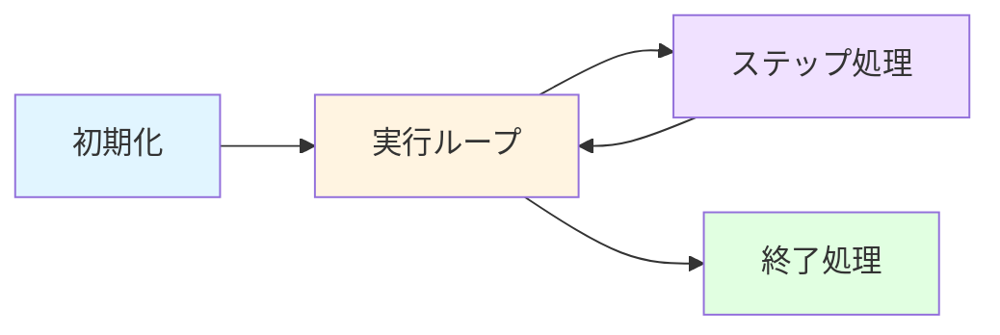
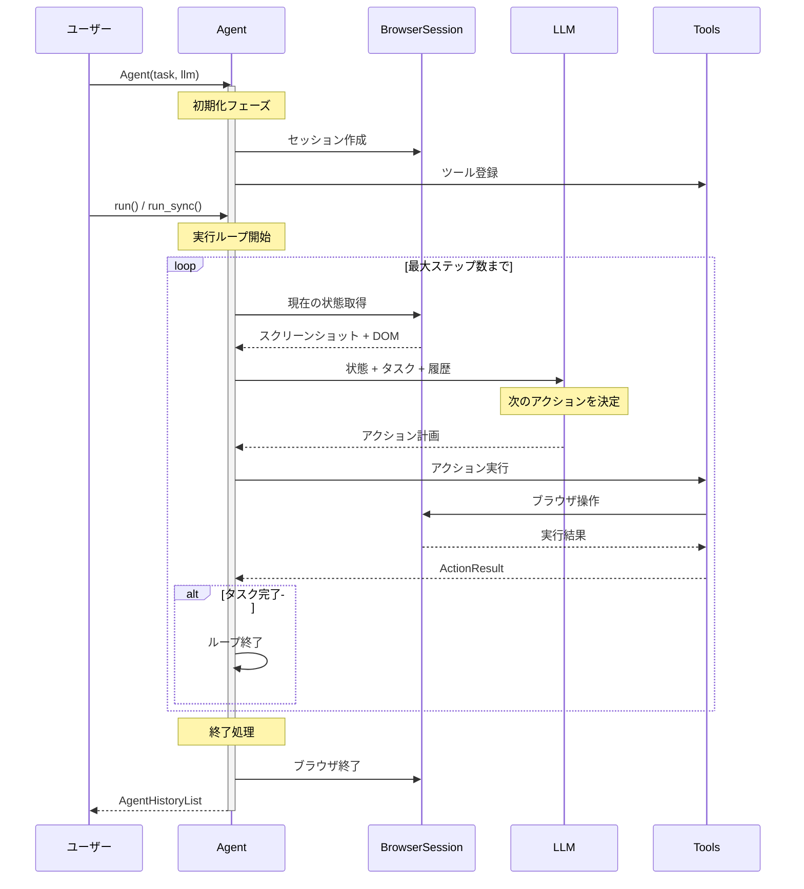

# Agent実行フローガイド

このドキュメントでは、browser-useの`Agent`がどのように動作するかを解説します。`agent.run()`を呼び出したとき、内部で何が起きているのかを理解することで、デバッグやカスタマイズがしやすくなります。

## 目次

- [クイックスタート](#クイックスタート)
- [全体アーキテクチャ](#全体アーキテクチャ)
- [詳細な実行フロー](#詳細な実行フロー)
- [各ステージの詳細](#各ステージの詳細)
- [よくある質問](#よくある質問)

## クイックスタート

最もシンプルなAgent使用例：

```python
from browser_use import Agent

# 1. Agentインスタンス作成
agent = Agent(
    task="Wikipediaでブラウザ自動化について調べる",
    llm=my_llm  # ChatGoogle, ChatOpenAI, etc.
)

# 2. 実行（同期）
result = agent.run_sync()

# 3. 結果確認
print(result.final_result())
```

内部では以下のステップが自動的に実行されます：
1. ブラウザの起動
2. タスク分解と計画
3. ブラウザ操作の実行（クリック、入力、スクロールなど）
4. 情報の収集と整理
5. ブラウザの終了

## 全体アーキテクチャ

Agentの動作は大きく4つのフェーズに分かれます：



### フェーズ概要

| フェーズ | 主な処理 | 重要性 |
|---------|---------|--------|
| **初期化** | LLM設定、ブラウザセッション準備、ツール登録 | すべての基盤を整える |
| **実行ループ** | 最大ステップ数まで繰り返し実行 | タスク完了まで継続 |
| **ステップ処理** | 状態取得 → LLM思考 → アクション実行 | Agentの「思考」と「行動」 |
| **終了処理** | リソース解放、結果の整理 | クリーンアップ |

## 詳細な実行フロー



## 各ステージの詳細

### 1. 初期化フェーズ (`Agent.__init__`)

**場所**: `browser_use/agent/service.py` の `Agent.__init__()`

**何が起こるか:**

```python
Agent(
    task="タスク内容",
    llm=my_llm,
    browser_session=None,  # 未指定なら自動作成
    max_steps=100
)
```

**内部処理:**

1. **LLMの解決**
   - LLMが指定されていない場合、デフォルト（`ChatGoogle`）を使用
   - 環境変数やCONFIGから自動検出

2. **ブラウザセッション準備**
   - 新規または既存のセッションを設定
   - CDP（Chrome DevTools Protocol）接続の準備
   - Chromiumの起動設定（ヘッドレス/ヘッドフル、プロファイル等）

3. **ツールシステム構築**
   - 利用可能なアクション（click, type, scroll等）を登録
   - カスタムツールがあれば追加
   - `TokenCost`でLLM使用量の記録を開始

4. **メッセージマネージャー設定**
   - システムプロンプトの構築
   - 会話履歴の管理準備
   - コンテキストウィンドウの最適化

5. **ワークスペース作成**
   - 一時ファイル用のディレクトリ作成
   - スクリーンショット保存先の準備

**なぜ重要か:**
このフェーズで問題があると、後続のすべての処理が失敗します。デバッグ時は、まずこのフェーズのログを確認しましょう。

---

### 2. 実行ループ (`Agent.run` / `Agent.run_sync`)

**場所**: `browser_use/agent/service.py` の `run()` メソッド

**同期版と非同期版:**

```python
# 非同期版（推奨）
result = await agent.run()

# 同期版（簡単だがブロッキング）
result = agent.run_sync()  # 内部で asyncio.run() を呼ぶ
```

**内部処理:**

```python
async def run(self):
    try:
        # 1. シグナルハンドラ登録（Ctrl+Cで停止など）
        self._setup_signal_handlers()

        # 2. テレメトリ初期化
        self._initialize_telemetry()

        # 3. ブラウザ起動
        await self.browser_session.start()

        # 4. 初期アクション実行（URLがあればナビゲート）
        await self._execute_initial_actions()

        # 5. メインループ
        while self.n_steps < self.max_steps:
            # ステップ実行
            await self.step()

            # 完了判定
            if self._is_task_complete():
                break

        # 6. 終了処理
        return await self.close()

    except Exception as e:
        # エラーハンドリング
        await self.close()
        raise
```

**制御フロー:**

- **最大ステップ数**: `max_steps`で制御（デフォルト: 100）
- **完了条件**: LLMが`done`アクションを返す、または手動中断
- **エラー時**: 自動的に`close()`を呼び出してリソース解放

**なぜ重要か:**
実行ループは、タスクが完了するまでステップを繰り返します。無限ループを防ぐため、`max_steps`を適切に設定することが重要です。

---

### 3. ステップ処理 (`Agent.step`)

**場所**: `browser_use/agent/service.py` の `step()` メソッド

ステップ処理は、Agentの「思考」と「行動」のサイクルです。

#### 3.1 状態取得フェーズ (`_prepare_context`)

**何が起こるか:**

```python
# 現在のブラウザ状態を取得
browser_state = await self.browser_session.get_state(
    use_vision=True  # スクリーンショット付き
)

# 取得される情報:
# - URL
# - タイトル
# - DOM構造（簡略化済み）
# - スクリーンショット（Base64エンコード）
# - 利用可能な要素リスト
```

**DOM処理の最適化:**

browser-useは、LLMに送るDOMを自動的に最適化します：
- 不要なタグ（`<script>`, `<style>`等）を削除
- インタラクティブ要素にインデックス番号を付与
- トークン数を制限（長すぎるページは切り詰め）

**なぜ重要か:**
LLMが正確な判断をするには、現在の状態を正確に把握する必要があります。特にスクリーンショットは、視覚的な要素（ボタンの位置、レイアウト等）を理解するのに不可欠です。

#### 3.2 思考フェーズ (`_get_next_action`)

**何が起こるか:**

```python
# LLMへのメッセージ構築
messages = [
    {"role": "system", "content": system_prompt},
    {"role": "user", "content": f"タスク: {self.task}"},
    *history_messages,
    {"role": "user", "content": browser_state}
]

# LLMに問い合わせ
response = await self.llm.ainvoke(messages)

# 構造化された出力
agent_output = AgentOutput(
    current_state={"thought": "...", "summary": "..."},
    action=[
        {"click_element": {"index": 5}},
        {"type_text": {"index": 3, "text": "検索クエリ"}}
    ]
)
```

**LLMが決定すること:**

1. **思考 (thought)**: なぜこのアクションを選んだか
2. **要約 (summary)**: 現在の状況の簡潔な説明
3. **アクション**: 次に実行する具体的な操作リスト

**利用可能なアクション例:**

```python
# ナビゲーション
{"navigate": {"url": "https://example.com"}}

# 要素操作
{"click_element": {"index": 5}}
{"type_text": {"index": 3, "text": "入力内容"}}

# ページ操作
{"scroll": {"direction": "down", "amount": 500}}
{"go_back": {}}

# 情報抽出
{"extract_page_content": {}}

# 完了
{"done": {"text": "タスク完了の説明"}}
```

**なぜ重要か:**
このフェーズは、Agentの「知能」が発揮される部分です。LLMの品質（モデルの選択、プロンプト設計）が、タスク成功率に直結します。

#### 3.3 実行フェーズ (`_execute_actions`)

**何が起こるか:**

```python
for action in agent_output.action:
    # アクションを実行
    result = await self.tools.execute(action, browser_state)

    # 結果を記録
    self.action_history.append({
        "action": action,
        "result": result,
        "success": result.is_done or result.extracted_content
    })
```

**アクション実行の流れ:**

1. **アクション検証**: 必須パラメータのチェック
2. **ブラウザ操作**: CDP経由でChromeを操作
3. **結果取得**: 成功/失敗、抽出データ等
4. **履歴更新**: 次のステップで参照できるように保存

**エラーハンドリング:**

```python
try:
    result = await action.execute()
except Exception as e:
    # リトライロジック
    if retry_count < max_retries:
        await asyncio.sleep(1)
        result = await action.execute()
    else:
        result = ActionResult(error=str(e))
```

**なぜ重要か:**
実際のブラウザ操作を行う部分です。ネットワークの遅延、ページの読み込み時間、要素の動的な変更など、現実世界の不確実性に対処する必要があります。

#### 3.4 後処理フェーズ (`_post_process`, `_finalize`)

**何が起こるか:**

```python
# 1. 履歴に追加
self.history.append(step_result)

# 2. テレメトリ送信（任意）
if self.telemetry_enabled:
    await self.telemetry.send_step_event(step_result)

# 3. クラウド同期（任意）
if self.cloud_sync_enabled:
    await self.cloud_client.sync_step(step_result)

# 4. ステップカウンタ増加
self.n_steps += 1

# 5. ファイルシステム状態保存
await self.workspace.save_state()
```

**なぜ重要か:**
履歴とテレメトリは、デバッグやパフォーマンス分析に不可欠です。また、長時間実行されるタスクでは、途中経過の保存が重要です。

---

### 4. 終了処理 (`Agent.close`)

**場所**: `browser_use/agent/service.py` の `close()` メソッド

**何が起こるか:**

```python
async def close(self):
    try:
        # 1. ブラウザ終了
        if not self.browser_session.keep_alive:
            await self.browser_session.close()

        # 2. LLMクライアント解放
        if hasattr(self.llm, 'aclose'):
            await self.llm.aclose()

        # 3. ガベージコレクション
        import gc
        gc.collect()

        # 4. 最終テレメトリ送信
        await self._send_final_telemetry()

        # 5. 結果の整理
        return AgentHistoryList(
            history=self.history,
            final_result=self._extract_final_result(),
            model_actions=self.action_history,
            # ... その他のメタデータ
        )

    except Exception as e:
        logger.error(f"Error during cleanup: {e}")
```

**返却される`AgentHistoryList`の内容:**

```python
result = agent.run_sync()

# 最終結果
print(result.final_result())  # タスクの結果テキスト

# 実行履歴
for step in result.history:
    print(f"Step {step.step_number}: {step.action}")

# 使用トークン数
print(f"Total tokens: {result.total_tokens}")

# 生成されたファイル
for file in result.generated_files:
    print(f"File: {file.path}")
```

**なぜ重要か:**
適切なクリーンアップは、メモリリークを防ぎ、長時間実行されるアプリケーションでも安定動作を保証します。

---

## よくある質問

### Q1: `max_steps`に達するとどうなる？

**A:** Agentは強制的に終了し、その時点までの結果を返します。通常、最後のステップで「タスクが完了していません」という旨のメッセージが含まれます。

```python
agent = Agent(task="...", max_steps=10)
result = agent.run_sync()

if result.is_complete:
    print("タスク完了")
else:
    print("ステップ数超過により中断")
```

### Q2: エラーが発生したらどうなる？

**A:** Agentは自動的に数回リトライします。それでも失敗する場合は、エラー情報を含めて終了します。

```python
try:
    result = agent.run_sync()
except Exception as e:
    print(f"エラー: {e}")
    # デバッグ情報はログファイルに記録されます
```

### Q3: ブラウザを再利用できる？

**A:** はい、`keep_alive=True`を設定することで可能です。

```python
browser_session = BrowserSession(keep_alive=True)
agent1 = Agent(task="タスク1", browser_session=browser_session)
result1 = agent1.run_sync()

# 同じブラウザセッションで次のタスク
agent2 = Agent(task="タスク2", browser_session=browser_session)
result2 = agent2.run_sync()

# 最後に明示的に終了
await browser_session.close()
```

### Q4: カスタムアクションを追加できる？

**A:** はい、`Tools`を拡張することで可能です。

```python
from browser_use import Tools

class CustomTools(Tools):
    @tool("custom_action")
    async def my_custom_action(self, param: str):
        """カスタムアクションの説明"""
        # 実装
        return ActionResult(extracted_content=result)

agent = Agent(
    task="...",
    tools=CustomTools()
)
```

### Q5: メモリ使用量が多い場合は？

**A:** 以下の対策が有効です：

1. **ビジョンモードをオフ**: `use_vision=False`
2. **履歴の制限**: `max_history_messages=10`
3. **DOMの簡略化**: より積極的なフィルタリング
4. **ステップ数の削減**: `max_steps=50`

```python
agent = Agent(
    task="...",
    use_vision=False,
    max_history_messages=10,
    max_steps=50
)
```

### Q6: デバッグログを有効にするには？

**A:** 環境変数でログレベルを設定します。

```bash
export BROWSER_USE_LOGGING_LEVEL=debug
python your_script.py
```

または、Pythonコード内で：

```python
import logging
logging.getLogger('browser_use').setLevel(logging.DEBUG)
```

---

## まとめ

Agentの実行フローは、以下の4つのフェーズで構成されます：

1. **初期化**: 必要なコンポーネントを準備
2. **実行ループ**: タスク完了まで繰り返し
3. **ステップ処理**: 状態取得 → LLM思考 → アクション実行
4. **終了処理**: リソース解放と結果の返却

各フェーズを理解することで、より効果的にAgentを活用し、問題が発生した際のデバッグが容易になります。

---

**参考リンク:**

- [Agent API リファレンス](../api/agent.md)
- [BrowserSession 詳細](../browser/session.md)
- [カスタムツールの作成](../tools/custom_tools.md)
- [トラブルシューティング](../troubleshooting.md)
