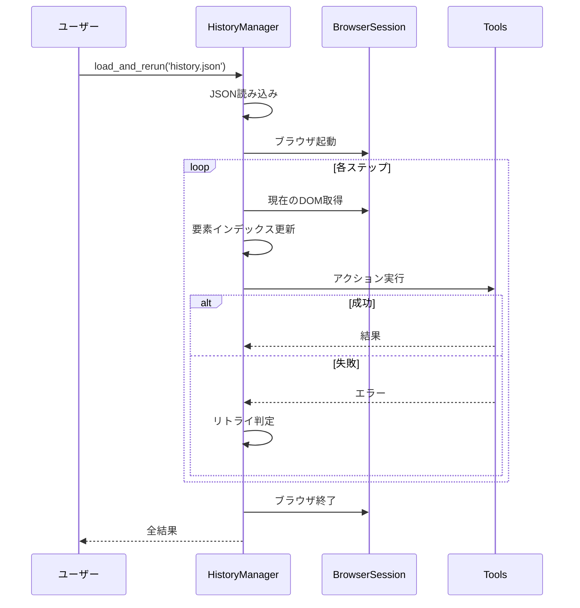

# HistoryManager - 履歴管理システム

このドキュメントでは、Agentの**履歴管理システム**について詳しく解説します。HistoryManagerは、エージェントの全ての行動を記録し、保存し、再実行する機能を提供します。

## 目次

- [概要](#概要)
- [なぜ重要なのか](#なぜ重要なのか)
- [Phase 1リファクタリング](#phase-1リファクタリング)
- [主要機能](#主要機能)
- [データ構造](#データ構造)
- [実装の詳細](#実装の詳細)
- [使用例](#使用例)
- [活用シーン](#活用シーン)
- [トラブルシューティング](#トラブルシューティング)
- [関連リソース](#関連リソース)

## 概要

### HistoryManagerとは？

**HistoryManager**は、Agentの実行履歴を管理する専門モジュールです。Phase 1リファクタリングでAgent本体から分離され、以下の責務を担います：

- ✅ **履歴アイテムの作成**: 各ステップの情報を構造化して記録
- ✅ **履歴の永続化**: JSON形式でファイルに保存（機密データ保護付き）
- ✅ **履歴の再実行**: 保存された操作を新しいセッションで再現
- ✅ **DOM変化対応**: 要素のインデックスが変わっても正確に再実行

**実装場所**: `browser_use/agent/history_manager/service.py` (235行)

### 基本的な使い方

```python
from browser_use import Agent
from browser_use.llm.openai.chat import ChatOpenAI

# 1. エージェントを実行
agent = Agent(task="Wikipedia で Python について調べる", llm=ChatOpenAI())
result = await agent.run(max_steps=10)

# 2. 履歴を保存
agent.save_history('my_task_history.json')

# 3. 履歴を再実行（別のAgentインスタンスで）
rerun_agent = Agent(task='', llm=ChatOpenAI())
await rerun_agent.load_and_rerun('my_task_history.json')
```

## なぜ重要なのか

履歴管理システムは、以下の理由で重要です：

### 1. **デバッグの効率化**

問題が発生したステップを完全に再現できます：

```python
# エラーが発生したタスクを保存
agent = Agent(task="複雑なフォーム入力", llm=llm)
try:
    await agent.run(max_steps=20)
except Exception:
    agent.save_history('error_case.json')  # エラー時の状態を保存

# 後で詳細に調査
debug_agent = Agent(task='', llm=llm)
await debug_agent.load_and_rerun('error_case.json')  # 同じ問題を再現
```

### 2. **テストの一貫性**

同じシナリオを何度も再実行できます：

```python
# 成功したワークフローを保存
agent.save_history('login_workflow.json')

# コード変更後、同じワークフローでテスト
test_agent = Agent(task='', llm=llm)
result = await test_agent.load_and_rerun('login_workflow.json')
assert all(r.success for r in result)
```

### 3. **コスト削減**

LLM呼び出しなしで保存されたアクションを再実行：

```python
# 開発中は履歴を再実行（LLM不使用）
# → トークン消費ゼロ
await agent.load_and_rerun('workflow.json')
```

### 4. **ワークフローの共有**

成功したタスクをチームで共有：

```python
# チームメンバーAが成功したワークフロー
agent_a.save_history('successful_checkout.json')

# チームメンバーBが同じ操作を再現
agent_b.load_and_rerun('successful_checkout.json')
```

## Phase 1リファクタリング

Phase 1のリファクタリングにより、履歴管理機能は独立したモジュールに分離されました：

**変更前**（Agent本体に混在）:
```python
# Agent.py 内に履歴管理コードが散在
class Agent:
    def _save_history_item(self, ...):  # 100行の履歴保存コード
        ...
    def _rerun_history(self, ...):       # 150行の再実行コード
        ...
```

**変更後**（専門モジュール）:
```python
# browser_use/agent/history_manager/service.py
class HistoryManager:
    """Manage agent history creation, persistence, and replay."""

    async def create_history_item(...)    # 履歴アイテム作成
    def save_history(...)                 # 保存
    async def load_and_rerun(...)         # 読み込み＆再実行
    async def rerun_history(...)          # 再実行制御
```

**メリット**:
- ✅ Agent本体が235行削減
- ✅ テストが容易（独立したユニットテスト可能）
- ✅ 機能拡張が簡単（再実行オプション等）

## 主要機能

### 1. 履歴アイテムの自動作成

**メソッド**: `create_history_item()`

**タイミング**: 各ステップの終了時に自動的に呼ばれる

**実装場所**: `browser_use/agent/history_manager/service.py:33-77`

```python
# StepExecutor の finalize() から自動的に呼ばれる
await history_manager.create_history_item(
    model_output=last_model_output,        # LLMの思考と決定したアクション
    browser_state_summary=browser_state,   # ブラウザの状態
    result=action_results,                 # アクション実行結果
    metadata=StepMetadata(
        step_number=n_steps,
        step_start_time=start_time,
        step_end_time=end_time,
    ),
    state_message=state_message,           # LLMに送った状態メッセージ
)
```

**記録される情報**:

| カテゴリ | 内容 | 例 |
|---------|------|-----|
| **LLM思考** | thinking, evaluation_previous_goal, memory, next_goal | "検索ボックスが見つかったのでクリックする" |
| **アクション** | 実行されたアクション名とパラメータ | `{"click_element": {"index": 5}}` |
| **実行結果** | is_done, long_term_memory, extracted_content等 | `{"is_done": false, "extracted_content": "..."}` |
| **ブラウザ状態** | URL、タイトル、タブ、操作した要素 | `{"url": "https://example.com", "title": "..."}` |
| **スクリーンショット** | スクリーンショットのファイルパス | `"/tmp/screenshots/step_5.png"` |
| **メタデータ** | ステップ番号、開始・終了時刻 | `{"step_number": 5, "duration": 12.3}` |

**初期アクションの記録**:

```python
# URLへの初期ナビゲーションも step 0 として保存される
agent = Agent(task="https://example.com にアクセスして...", llm=llm)
await agent.run()
# → step 0: navigate to https://example.com が履歴に含まれる
```

### 2. 履歴の保存

**メソッド**: `save_history(file_path)`

**実装場所**: `browser_use/agent/history_manager/service.py:117-123`

```python
# 基本的な保存
agent.save_history('my_history.json')

# カスタムパスに保存
agent.save_history('/path/to/histories/task_001.json')
```

**保存形式**: JSON（人間が読める形式）

```json
{
  "history": [
    {
      "model_output": {
        "thinking": "ページが読み込まれた。次は検索ボックスを探す。",
        "evaluation_previous_goal": "URLへのナビゲーションが成功した",
        "memory": "https://example.com にアクセス完了",
        "next_goal": "検索ボックスに「Python」と入力する",
        "action": [
          {
            "type_text": {
              "index": 3,
              "text": "Python"
            }
          }
        ]
      },
      "result": [
        {
          "is_done": false,
          "long_term_memory": "入力ボックスにPythonと入力完了",
          "extracted_content": "入力完了",
          "include_extracted_content_only_once": false,
          "include_in_memory": false
        }
      ],
      "state": {
        "url": "https://example.com",
        "title": "Example Domain",
        "tabs": [
          {
            "url": "https://example.com",
            "title": "Example Domain",
            "target_id": "ABC123",
            "parent_target_id": null
          }
        ],
        "screenshot_path": "/tmp/browser_use/screenshots/step_2.png",
        "interacted_element": [
          {
            "node_id": 42,
            "backend_node_id": 123,
            "frame_id": null,
            "node_type": 1,
            "node_value": "",
            "node_name": "INPUT",
            "attributes": {
              "type": "text",
              "name": "q",
              "placeholder": "検索..."
            },
            "x_path": "html/body/div/form/input",
            "element_hash": 1234567890123456789,
            "bounds": {
              "x": 100.0,
              "y": 200.0,
              "width": 300.0,
              "height": 40.0
            }
          }
        ]
      },
      "metadata": {
        "step_number": 2,
        "step_start_time": 1697123456.789,
        "step_end_time": 1697123470.123
      },
      "state_message": "<agent_history>\n...\n</agent_history>\n<agent_state>\n...\n</agent_state>\n<browser_state>\n...\n</browser_state>"
    }
  ]
}
```

**注**:
- `state_message` は非常に長い文字列で、LLMに送られた完全なコンテキストが含まれます（簡潔化のため省略）
- `interacted_element` がアクションによって要素を操作した場合は詳細な情報が、操作していない場合（navigateやscroll等）は `null` が格納されます

**機密データの自動フィルタリング**:

```python
# 機密データを指定
agent = Agent(
    task="ログインして...",
    llm=llm,
    sensitive_data={
        'password': 'my_secret_password',
        'api_key': 'sk-1234567890abcdef'
    }
)
await agent.run()
agent.save_history('login.json')

# 保存されたJSON内では:
# "my_secret_password" → "<secret>password</secret>"
# "sk-1234567890abcdef" → "<secret>api_key</secret>"
```

**ドメイン別の機密データ管理**（新フォーマット）:

```python
# より細かい制御が可能
agent = Agent(
    task="複数サイトにログイン",
    llm=llm,
    sensitive_data={
        'https://site1.com': {
            'username': 'user1',
            'password': 'pass1'
        },
        'https://site2.com': {
            'api_token': 'token123'
        }
    }
)
```

### 3. 履歴の読み込みと再実行

**メソッド**: `load_and_rerun(history_file, **kwargs)`

**実装場所**: `browser_use/agent/history_manager/service.py:125-132`

```python
# シンプルな再実行
rerun_agent = Agent(task='', llm=llm)
results = await rerun_agent.load_and_rerun('my_history.json')

# オプション付き再実行
results = await rerun_agent.load_and_rerun(
    'my_history.json',
    max_retries=5,              # リトライ回数（デフォルト: 3）
    skip_failures=True,         # 失敗時も続行（デフォルト: True）
    delay_between_actions=3.0   # アクション間の待機時間（デフォルト: 2.0秒）
)
```

**再実行の流れ**:



**DOM変化対応**:

履歴保存時と再実行時でページのDOM構造が変わっていても、`element_hash`を使って要素を特定します：

```python
# 保存時: インデックス5の要素
{
    "click_element": {"index": 5},
    "interacted_element": {
        "node_name": "BUTTON",
        "element_hash": 1234567890123456789,
        "attributes": {"class": "submit-btn"},
        "x_path": "html/body/div/button"
    }
}

# 再実行時: 要素が追加されてインデックスが7に変わっている
# → element_hash (1234567890123456789) でマッチング → インデックスを7に自動更新
```

**実装**: `_update_action_indices()` (browser_use/agent/history_manager/service.py:207-235)

### 4. 高度な再実行制御

**メソッド**: `rerun_history(history, **options)`

**実装場所**: `browser_use/agent/history_manager/service.py:134-179`

```python
# HistoryListオブジェクトを直接渡す
from browser_use.agent.views import AgentHistoryList

# カスタムフィルタリング
loaded_history = AgentHistoryList.load_from_file('full_history.json', agent.AgentOutput)

# 最初の5ステップだけ再実行
partial_history = AgentHistoryList(history=loaded_history.history[:5])
results = await agent.rerun_history(partial_history)
```

**リトライロジック**:

```python
# 各ステップで最大5回リトライ
results = await agent.rerun_history(
    history,
    max_retries=5,
    skip_failures=False  # 失敗したら例外を投げる
)
```

**失敗時の動作**:

| オプション | 動作 |
|-----------|------|
| `skip_failures=True` (デフォルト) | エラーをログに記録して次のステップへ |
| `skip_failures=False` | 例外を投げて再実行を中断 |

## データ構造

### AgentHistory

**実装場所**: `browser_use/agent/views.py:245-358`

```python
@dataclass
class AgentHistory(BaseModel):
    """単一ステップの履歴アイテム"""

    model_output: AgentOutput | None      # LLMの出力（思考＋アクション）
    result: list[ActionResult]            # アクション実行結果
    state: BrowserStateHistory            # ブラウザ状態
    metadata: StepMetadata | None         # メタデータ（時間、ステップ番号等）
    state_message: str | None             # LLMに送った状態メッセージ
```

### AgentHistoryList

**実装場所**: `browser_use/agent/views.py:364-336`

```python
class AgentHistoryList(BaseModel):
    """履歴アイテムのリスト + ユーティリティメソッド"""

    history: list[AgentHistory]           # 履歴アイテム
    usage: UsageSummary | None            # トークン使用量とコスト

    # 保存・読み込み
    def save_to_file(filepath, sensitive_data=None)
    def load_from_file(filepath, output_model)

    # クエリ
    def is_done() -> bool                 # タスク完了？
    def is_successful() -> bool | None    # 成功？
    def final_result() -> str | None      # 最終結果
    def errors() -> list[str | None]      # 各ステップのエラー
    def has_errors() -> bool              # エラーあり？

    # データ抽出
    def urls() -> list[str]               # 訪問したURL
    def screenshot_paths() -> list[str]   # スクリーンショットパス
    def action_names() -> list[str]       # アクション名
    def model_thoughts() -> list[AgentBrain]  # LLMの思考
    def extracted_content() -> list[str]  # 抽出コンテンツ

    # 統計
    def number_of_steps() -> int          # ステップ数
    def total_duration_seconds() -> float # 合計実行時間
```

### BrowserStateHistory

**実装場所**: `browser_use/browser/views.py`

```python
@dataclass
class BrowserStateHistory:
    """ブラウザ状態の履歴記録"""

    url: str                              # 現在のURL
    title: str                            # ページタイトル
    tabs: list[TabInfo]                   # 開いているタブ
    screenshot_path: str | None           # スクリーンショットファイルパス
    interacted_element: list[DOMInteractedElement | None]  # 操作した要素

class TabInfo(BaseModel):
    """タブ情報"""
    url: str                              # タブのURL
    title: str                            # タブのタイトル
    target_id: str                        # CDP Target ID
    parent_target_id: str | None          # 親TargetのID（ポップアップ等）
```

### DOMInteractedElement

**実装場所**: `browser_use/dom/views.py`

操作された要素の詳細情報（要素を操作したアクションの場合のみ）:

```python
@dataclass
class DOMInteractedElement:
    """操作された要素の情報"""

    node_id: int                          # CDP Node ID
    backend_node_id: int                  # CDP Backend Node ID
    frame_id: str | None                  # フレームID（iframe内の場合）
    node_type: int                        # ノードタイプ（1=Element, 3=Text等）
    node_value: str                       # ノードの値
    node_name: str                        # タグ名（"A", "BUTTON", "INPUT"等）
    attributes: dict[str, str]            # 要素の属性
    x_path: str                           # XPath
    element_hash: int                     # 要素の一意識別子（再実行時のマッチングに使用）
    bounds: dict[str, float]              # 要素の位置とサイズ
```

**実際の例**:
```json
{
  "node_id": 42,
  "backend_node_id": 123,
  "frame_id": null,
  "node_type": 1,
  "node_value": "",
  "node_name": "A",
  "attributes": {
    "href": "https://example.com",
    "class": "link-button",
    "target": "_blank"
  },
  "x_path": "html/body/div[2]/a[3]",
  "element_hash": 1234567890123456789,
  "bounds": {
    "x": 100.5,
    "y": 200.0,
    "width": 150.0,
    "height": 40.0
  }
}
```

**注**: navigateやscroll等、特定の要素を操作しないアクションの場合、`interacted_element` は `null` になります。

### StepMetadata

**実装場所**: `browser_use/agent/views.py:129-139`

```python
class StepMetadata(BaseModel):
    """ステップのメタデータ"""

    step_number: int                      # ステップ番号
    step_start_time: float                # 開始時刻（UNIX timestamp）
    step_end_time: float                  # 終了時刻（UNIX timestamp）

    @property
    def duration_seconds(self) -> float:
        """ステップの実行時間（秒）"""
        return self.step_end_time - self.step_start_time
```

## 実装の詳細

### 履歴アイテムの作成フロー

```python
async def create_history_item(
    self,
    model_output: AgentOutput | None,
    browser_state_summary: BrowserStateSummary,
    result: list[ActionResult],
    metadata: StepMetadata | None = None,
    state_message: str | None = None,
) -> None:
    agent = self.agent

    # 1. 操作した要素の情報を抽出
    if model_output:
        interacted_elements = AgentHistory.get_interacted_element(
            model_output,
            browser_state_summary.dom_state.selector_map,
        )
    else:
        interacted_elements = [None]

    # 2. スクリーンショットを保存
    screenshot_path = None
    if browser_state_summary.screenshot:
        screenshot_path = await agent.screenshot_service.store_screenshot(
            browser_state_summary.screenshot,
            agent.state.n_steps,
        )

    # 3. ブラウザ状態履歴を作成
    state_history = BrowserStateHistory(
        url=browser_state_summary.url,
        title=browser_state_summary.title,
        tabs=browser_state_summary.tabs,
        interacted_element=interacted_elements,
        screenshot_path=screenshot_path,
    )

    # 4. 履歴アイテムを作成
    history_item = AgentHistory(
        model_output=model_output,
        result=result,
        state=state_history,
        metadata=metadata,
        state_message=state_message,
    )

    # 5. 履歴リストに追加
    agent.history.add_item(history_item)
```

### 再実行時の要素インデックス更新

**課題**: 保存時と再実行時でDOMの要素順序が変わる

**解決策**: `element_hash`（要素の一意識別子）でマッチング

```python
async def _update_action_indices(
    self,
    historical_element: DOMInteractedElement | None,
    action: ActionModel,
    browser_state_summary: BrowserStateSummary,
) -> ActionModel | None:
    """現在のDOMに合わせてアクションのインデックスを更新する"""

    if not historical_element or not browser_state_summary.dom_state.selector_map:
        return action

    # element_hash でマッチング
    match = next(
        (
            (highlight_index, element)
            for highlight_index, element in browser_state_summary.dom_state.selector_map.items()
            if element.element_hash == historical_element.element_hash
        ),
        (None, None),
    )
    highlight_index, current_element = match

    if not current_element or highlight_index is None:
        # 要素が見つからない → エラー
        return None

    # インデックスが変わっていればログ出力して更新
    old_index = action.get_index()
    if old_index != highlight_index:
        self.agent.logger.info(
            f'Element moved in DOM, updated index from {old_index} to {highlight_index}'
        )
        action.set_index(highlight_index)

    return action
```

**element_hashの計算**:

要素のタグ、テキスト、主要な属性から一意のハッシュ（整数）を生成します。このハッシュにより、DOMの順序が変わっても同じ要素を特定できます。詳細は `browser_use/dom/views.py` を参照。

**実際の履歴ファイルの例**（temp/agent_history.jsonより）:

```json
{
  "history": [
    {
      "model_output": {
        "thinking": "検索を開始する",
        "evaluation_previous_goal": "Agent initialized. Starting the task.",
        "memory": "Initial step.",
        "next_goal": "Search for information",
        "action": [
          {
            "search": {
              "query": "browser-use github",
              "engine": "duckduckgo"
            }
          }
        ]
      },
      "result": [
        {
          "is_done": false,
          "long_term_memory": "Searched Duckduckgo for 'browser-use github'",
          "extracted_content": "Searched Duckduckgo for 'browser-use github'",
          "include_extracted_content_only_once": false,
          "include_in_memory": false
        }
      ],
      "state": {
        "url": "about:blank",
        "title": "Empty Tab",
        "tabs": [
          {
            "url": "about:blank",
            "title": "",
            "target_id": "CB09",
            "parent_target_id": null
          }
        ],
        "screenshot_path": null,
        "interacted_element": [null]
      },
      "metadata": {
        "step_number": 1,
        "step_start_time": 1760498023.5604107,
        "step_end_time": 1760498028.0634792
      },
      "state_message": "<agent_history>...</agent_history><agent_state>...</agent_state><browser_state>...</browser_state>"
    }
  ]
}
```

## 使用例

### 例1: 基本的な保存と再実行

```python
import asyncio
from browser_use import Agent
from browser_use.llm.openai.chat import ChatOpenAI

async def main():
    llm = ChatOpenAI(model='gpt-4o-mini')

    # タスクを実行して履歴を保存
    agent = Agent(
        task='https://example.com にアクセスして、検索ボックスに「AI」と入力',
        llm=llm
    )
    await agent.run(max_steps=5)
    agent.save_history('search_task.json')

    # 同じ操作を再実行
    rerun_agent = Agent(task='', llm=llm)
    results = await rerun_agent.load_and_rerun('search_task.json')

    print(f'再実行完了: {len(results)}個のアクション')
    for i, result in enumerate(results, 1):
        print(f'  {i}. {"成功" if result.success else "失敗"}: {result.extracted_content}')

asyncio.run(main())
```

### 例2: エラー時のデバッグ

```python
import asyncio
from browser_use import Agent
from browser_use.llm.openai.chat import ChatOpenAI

async def debug_workflow():
    llm = ChatOpenAI(model='gpt-4o-mini')

    # エラーが発生したタスク
    agent = Agent(task='複雑なフォーム入力タスク', llm=llm)

    try:
        await agent.run(max_steps=20)
    except Exception as e:
        print(f'エラー発生: {e}')
        # エラー時の状態を保存
        agent.save_history('error_debug.json')

        # 履歴を確認
        for i, item in enumerate(agent.history.history, 1):
            if item.result and any(r.error for r in item.result):
                print(f'\nステップ{i}でエラー:')
                print(f'  URL: {item.state.url}')
                print(f'  エラー: {item.result[0].error}')
                print(f'  思考: {item.model_output.thinking if item.model_output else "N/A"}')

asyncio.run(debug_workflow())
```

### 例3: テスト自動化

```python
import asyncio
import pytest
from browser_use import Agent
from browser_use.llm.openai.chat import ChatOpenAI

@pytest.mark.asyncio
async def test_login_workflow():
    """ログインワークフローの回帰テスト"""
    llm = ChatOpenAI(model='gpt-4o-mini')

    # 保存済みのログインワークフローを再実行
    agent = Agent(task='', llm=llm)
    results = await agent.load_and_rerun('golden_login_workflow.json')

    # すべてのステップが成功したか確認
    assert all(r.success is not False for r in results), "ログインワークフローに失敗"

    # 最終結果の確認
    assert agent.history.is_done(), "タスクが完了していない"
    assert agent.history.is_successful(), "タスクは完了したが成功とマークされていない"
```

### 例4: 部分的な再実行

```python
import asyncio
from browser_use import Agent
from browser_use.agent.views import AgentHistoryList
from browser_use.llm.openai.chat import ChatOpenAI

async def partial_rerun():
    llm = ChatOpenAI(model='gpt-4o-mini')
    agent = Agent(task='', llm=llm)

    # 履歴を読み込む
    full_history = AgentHistoryList.load_from_file('long_task.json', agent.AgentOutput)

    print(f'合計ステップ数: {len(full_history.history)}')

    # 最初の3ステップだけ再実行
    partial = AgentHistoryList(history=full_history.history[:3])
    results = await agent.rerun_history(partial, delay_between_actions=1.0)

    print(f'再実行完了: {len(results)}個のアクション')

asyncio.run(partial_rerun())
```

### 例5: 機密データ保護

```python
import asyncio
from browser_use import Agent
from browser_use.llm.openai.chat import ChatOpenAI

async def secure_save():
    llm = ChatOpenAI(model='gpt-4o-mini')

    # 機密データを指定
    agent = Agent(
        task='サイトにログインして情報を取得',
        llm=llm,
        sensitive_data={
            'username': 'john.doe@example.com',
            'password': 'super_secret_password_123',
            'api_key': 'sk-proj-1234567890abcdef'
        }
    )

    await agent.run(max_steps=10)

    # 保存時に自動的にマスキング
    agent.save_history('login_history.json')

    # 保存されたファイル内では:
    # "john.doe@example.com" → "<secret>username</secret>"
    # "super_secret_password_123" → "<secret>password</secret>"
    # "sk-proj-1234567890abcdef" → "<secret>api_key</secret>"

asyncio.run(secure_save())
```

### 例6: 履歴データの分析

```python
import asyncio
from browser_use.agent.views import AgentHistoryList
from browser_use import Agent

async def analyze_history():
    agent = Agent(task='', llm=None)  # LLM不要（分析のみ）

    # 履歴を読み込む
    history = AgentHistoryList.load_from_file('task_history.json', agent.AgentOutput)

    print('=== 履歴分析 ===')
    print(f'ステップ数: {history.number_of_steps()}')
    print(f'合計実行時間: {history.total_duration_seconds():.1f}秒')
    print(f'タスク完了: {history.is_done()}')
    print(f'成功: {history.is_successful()}')
    print(f'エラーあり: {history.has_errors()}')

    print('\n訪問したURL:')
    for url in history.urls():
        print(f'  - {url}')

    print('\n実行したアクション:')
    for action_name in history.action_names():
        print(f'  - {action_name}')

    print('\nエラー履歴:')
    for i, error in enumerate(history.errors(), 1):
        if error:
            print(f'  ステップ{i}: {error}')

    print('\n抽出されたコンテンツ:')
    for content in history.extracted_content():
        print(f'  - {content[:100]}...')  # 最初の100文字

asyncio.run(analyze_history())
```

## 活用シーン

### 1. デバッグとトラブルシューティング

**シーン**: 本番環境で問題が発生

```python
# 本番環境で実行
production_agent = Agent(task='ユーザー報告のバグ再現', llm=llm)
try:
    await production_agent.run()
except Exception:
    production_agent.save_history('production_error.json')
    # → 開発環境で詳細調査
```

**メリット**:
- 本番環境の正確な状態を再現
- スクリーンショット付きで視覚的に確認
- ステップごとのLLM思考を追跡

### 2. 回帰テスト

**シーン**: コード変更後の影響確認

```python
# ゴールデンケースを保存
golden_agent.save_history('golden/checkout_flow.json')

# コード変更後、同じシナリオでテスト
@pytest.mark.asyncio
async def test_checkout_after_refactor():
    test_agent = Agent(task='', llm=llm)
    results = await test_agent.load_and_rerun('golden/checkout_flow.json')
    assert all(r.success is not False for r in results)
```

**メリット**:
- UI変更の影響を自動検出
- リファクタリング時の安心感
- CI/CDパイプラインに組み込み可能

### 3. LLMモデルの比較

**シーン**: 異なるモデルのパフォーマンス比較

```python
# GPT-4o-mini で実行して保存
agent_mini = Agent(task='複雑なタスク', llm=ChatOpenAI('gpt-4o-mini'))
await agent_mini.run()
agent_mini.save_history('task_gpt4o_mini.json')

# 同じタスクを GPT-4o で再実行
agent_4o = Agent(task='', llm=ChatOpenAI('gpt-4o'))
await agent_4o.load_and_rerun('task_gpt4o_mini.json')

# → 同じアクション列をGPT-4oで実行した場合の挙動を確認
```

### 4. トレーニングデータ生成

**シーン**: 成功例を収集してファインチューニング

```python
# 成功したタスクを保存
if agent.history.is_successful():
    agent.save_history(f'training_data/success_{task_id}.json')

# 後でトレーニングデータとして利用
# → LLMの思考プロセスを学習
```

### 5. ドキュメント作成

**シーン**: ユーザーガイドの作成

```python
# タスクを実行
guide_agent = Agent(task='アカウント登録手順', llm=llm)
await guide_agent.run()
guide_agent.save_history('guide_signup.json')

# スクリーンショットを抽出してドキュメント化
screenshots = guide_agent.history.screenshot_paths()
for i, path in enumerate(screenshots, 1):
    print(f'ステップ{i}: {path}')
    # → ドキュメントに埋め込む
```

## トラブルシューティング

### 問題1: 再実行時に要素が見つからない

**症状**:
```
ValueError: Could not find matching element 3 in current page
```

**原因**: DOM構造が大きく変わり、`element_hash`でマッチングできない

**解決策**:

```python
# オプション1: 失敗をスキップして続行
results = await agent.load_and_rerun(
    'history.json',
    skip_failures=True  # エラーを無視
)

# オプション2: 履歴を編集して問題のステップを削除
history = AgentHistoryList.load_from_file('history.json', agent.AgentOutput)
history.history = [h for h in history.history if h.metadata.step_number != 3]
await agent.rerun_history(history)
```

### 問題2: 再実行が遅い

**症状**: 再実行に予想以上に時間がかかる

**原因**: デフォルトの `delay_between_actions=2.0` が長い

**解決策**:

```python
# 待機時間を短縮
results = await agent.load_and_rerun(
    'history.json',
    delay_between_actions=0.5  # 0.5秒に短縮
)
```

### 問題3: メモリ使用量が多い

**症状**: 長い履歴ファイルでメモリ不足

**原因**: スクリーンショットが大量に保存されている

**解決策**:

```python
# 部分的に再実行
history = AgentHistoryList.load_from_file('long_history.json', agent.AgentOutput)

# 10ステップずつ処理
for i in range(0, len(history.history), 10):
    partial = AgentHistoryList(history=history.history[i:i+10])
    results = await agent.rerun_history(partial)
    # 結果を処理
    await agent.close()  # ブラウザをクローズしてメモリ解放
```

### 問題4: JSON保存エラー

**症状**:
```
TypeError: Object of type datetime is not JSON serializable
```

**原因**: カスタムアクションに非JSON型が含まれている

**解決策**:

カスタムアクションは `model_dump()` でシリアライズ可能な型のみ使用してください：

```python
# ❌ NG: datetimeは直接保存できない
class CustomAction(BaseModel):
    timestamp: datetime

# ✅ OK: floatやstrで保存
class CustomAction(BaseModel):
    timestamp: float  # UNIX timestamp
```

### 問題5: 機密データが漏れている

**症状**: 保存した履歴に生のパスワードが含まれている

**原因**: `sensitive_data` が設定されていない

**解決策**:

```python
# 必ず sensitive_data を設定
agent = Agent(
    task='ログインタスク',
    llm=llm,
    sensitive_data={
        'password': os.environ['USER_PASSWORD'],
        'api_key': os.environ['API_KEY']
    }
)
await agent.run()
agent.save_history('login.json')  # 自動的にマスキングされる
```

## 関連リソース

### 📚 関連ドキュメント

- [README.md](./README.md) - Agent概要とモジュール構成
- [agent_flow.md](./agent_flow.md) - Agent全体の実行フロー
- [step_processing.md](./step_processing.md) - ステップ処理の詳細

### 🔗 実装ファイル

- `browser_use/agent/history_manager/service.py` - HistoryManager本体
- `browser_use/agent/views.py` - AgentHistory, AgentHistoryList
- `browser_use/browser/views.py` - BrowserStateHistory
- `examples/features/rerun_history.py` - 使用例

### 🧪 テストファイル

- `tests/unit/test_history_manager.py` - HistoryManagerのユニットテスト
- `tests/ci/test_sync_client_auth.py` - 履歴保存のCI テスト

### 📖 関連概念

- **AgentOutput**: LLMの出力形式（thinking, memory, action等）
- **ActionResult**: アクション実行結果
- **DOMInteractedElement**: 操作した要素の情報
- **element_hash**: 要素の一意識別子

---

**最終更新**: 2025年10月15日（Phase 1リファクタリング反映）
**対応バージョン**: browser-use 0.8.0
