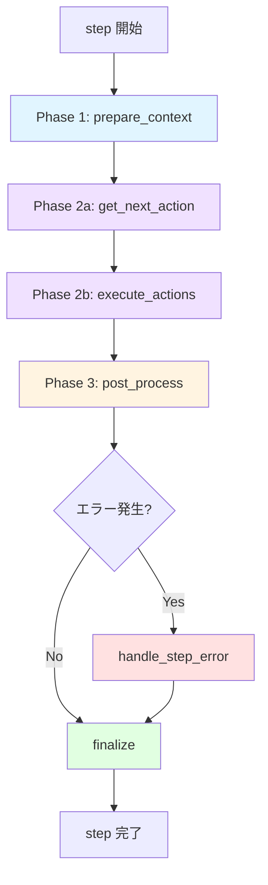
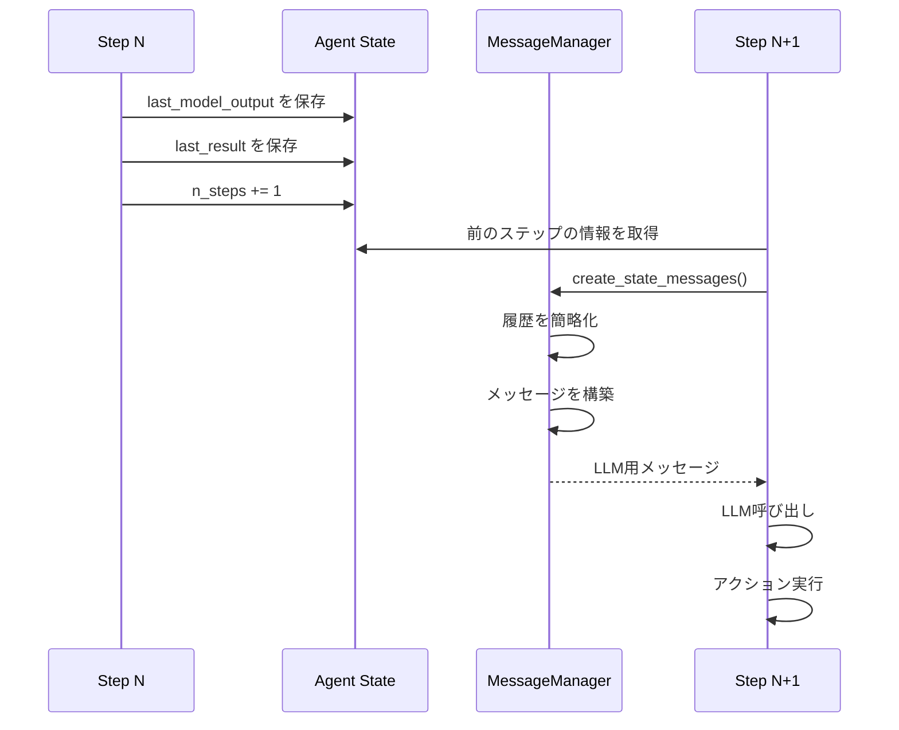

# ステップ処理の詳細解説

このドキュメントでは、Agent の最も重要な部分である「ステップ処理」について詳しく解説します。ステップ処理は、Agent が「考え」「行動し」「学習する」というサイクルの実装そのものです。

## 目次

- [概要](#概要)
- [ステップ処理の全体構造](#ステップ処理の全体構造)
- [Phase 1: コンテキスト準備](#phase-1-コンテキスト準備)
- [Phase 2: LLM思考とアクション実行](#phase-2-llm思考とアクション実行)
- [インタラクティブモード（任意）](#インタラクティブモード任意)
- [Phase 3: 後処理](#phase-3-後処理)
- [エラーハンドリング](#エラーハンドリング)
- [最終処理](#最終処理)
- [データフロー](#データフロー)
- [パフォーマンス最適化](#パフォーマンス最適化)
- [デバッグとトラブルシューティング](#デバッグとトラブルシューティング)
- [実装パターン](#実装パターン)

## 概要

### ステップとは？

**ステップ**は、Agent が目標達成に向けて実行する最小単位の処理サイクルです。人間に例えると：

1. **状況を観察する**（目で見る、情報を集める）
2. **考える**（何をすべきか判断する）
3. **行動する**（実際に手を動かす）
4. **結果を確認する**（うまくいったか確認）

これを1ステップとして、目標が達成されるまで繰り返します。

### なぜ重要なのか？

ステップ処理は：
- Agent の「知性」の大部分を担う
- パフォーマンスとコストに直結する
- デバッグの主な対象となる
- カスタマイズの主な対象となる

### Phase 1リファクタリングによる変更

Phase 1のリファクタリングにより、ステップ処理は **StepExecutor** モジュールに分離されました：

- **場所**: `browser_use/agent/step_executor/service.py`
- **責務**: ステップ実行のコーディネーション（状態取得 → LLM思考 → アクション実行 → 後処理）
- **連携**: FilesystemManager, HistoryManager, LLMHandler, TelemetryHandler と協調動作

## ステップ処理の全体構造

**実装場所**: `browser_use/agent/step_executor/service.py`

### アーキテクチャ図



### コード構造

```python
async def step(self) -> None:
    """1ステップの実行"""
    self.step_start_time = time.time()

    try:
        # Phase 1: コンテキスト準備
        browser_state = await self._prepare_context(step_info)

        # Phase 2: LLM思考 + アクション実行
        while True:
            await self._get_next_action(browser_state)

            if not self.settings.interactive_mode:
                break

            decision = await self._request_human_approval(browser_state)
            if decision.decision == "retry":
                # 人間からのフィードバックをメッセージに追加し、再度 LLM を呼び出す
                ...
                continue
            if decision.decision == "skip":
                return
            if decision.decision == "cancel":
                raise InterruptedError("Human cancelled the run")

            break

        await self._execute_actions()

        # Phase 3: 後処理
        await self._post_process()

    except Exception as e:
        # エラーハンドリング
        await self._handle_step_error(e)

    finally:
        # 最終処理（必ず実行）
        await self._finalize(browser_state)
```

### タイミング構造

```
┌─────────────────────── ステップ全体 ──────────────────────┐
│                                                             │
│  ┌─ prepare ─┐  ┌─ LLM ─┐  ┌─ exec ─┐  ┌─ post ─┐       │
│  │    5s     │  │  10s  │  │   3s   │  │   2s   │       │
│  └───────────┘  └───────┘  └────────┘  └────────┘       │
│                                                             │
│  ◄───────────── 約20秒 ─────────────►                     │
└─────────────────────────────────────────────────────────┘

典型的なステップの所要時間:
- 軽量なページ: 10-20秒
- 重いページ: 30-60秒
- 複雑なアクション: 60秒以上
```

## Phase 1: コンテキスト準備

**実装場所**: `browser_use/agent/step_executor/service.py`

**目的**: LLM が判断を下すために必要なすべての情報を収集・整理する

### 実行される処理

```python
async def _prepare_context(self, step_info: AgentStepInfo | None) -> BrowserStateSummary:
    """コンテキスト準備"""

    # 1. ブラウザ状態の取得
    # （get_browser_state_summary実装: browser_use/browser/session.py:1119）
    browser_state = await self.browser_session.get_browser_state_summary(
        include_screenshot=True,      # 常にスクリーンショット取得
        include_recent_events=True    # 最近のイベント（クリック等）も取得
    )

    # 2. ダウンロード確認
    # （check_and_update_downloads実装: browser_use/agent/filesystem_manager/service.py）
    await self._check_and_update_downloads()

    # 3. 停止/一時停止の確認
    await self._check_stop_or_pause()

    # 4. アクションモデルの更新（ページ固有）
    # （_update_action_models_for_page実装: browser_use/agent/service.py）
    await self._update_action_models_for_page(browser_state.url)

    # 5. メッセージの作成
    self._message_manager.create_state_messages(
        browser_state_summary=browser_state,
        model_output=self.state.last_model_output,
        result=self.state.last_result,
        use_vision=self.settings.use_vision,
        # ... その他のパラメータ
    )

    # 6. 最終ステップの強制処理
    await self._force_done_after_last_step(step_info)
    await self._force_done_after_failure()

    return browser_state
```

### 取得されるブラウザ状態

**実装場所**: `browser_use/browser/views.py:69`

```python
@dataclass
class BrowserStateSummary:
    """ブラウザの現在の状態"""

    # 基本情報
    url: str                          # 現在のURL
    title: str                        # ページタイトル

    # DOM情報
    tabs: list[TabInfo]               # 開いているタブ
    interactable_elements: list[DOMElement]  # 操作可能な要素

    # 視覚情報
    screenshot: str | None            # Base64エンコードされた画像

    # イベント情報
    recent_events: list[BrowserEvent] # 最近のブラウザイベント

    # その他
    selector_map: dict[int, str]      # 要素インデックス→セレクタのマップ
```

### DOM要素の例

```python
# ブラウザから取得される要素情報
interactable_elements = [
    DOMElement(
        index=1,
        tag="button",
        text="検索",
        attributes={"class": "search-btn", "id": "search-button"},
        xpath="//button[@id='search-button']",
        is_visible=True,
        is_clickable=True
    ),
    DOMElement(
        index=2,
        tag="input",
        text="",
        attributes={"type": "text", "placeholder": "検索キーワード"},
        xpath="//input[@type='text']",
        is_visible=True,
        is_editable=True
    ),
    # ... 数百の要素
]
```

### メッセージの構築

```python
# LLMに送られるメッセージ構造
messages = [
    # システムプロンプト
    {
        "role": "system",
        "content": """あなたはブラウザ自動化エージェントです。
        タスクを達成するために、以下のアクションを使用できます：
        - navigate: URLに移動
        - click_element: 要素をクリック
        - type_text: テキストを入力
        ...（全アクションのリスト）
        """
    },

    # タスク説明
    {
        "role": "user",
        "content": f"タスク: {self.task}"
    },

    # 過去の履歴（簡略化）
    *history_messages,

    # 現在のブラウザ状態
    {
        "role": "user",
        "content": [
            {
                "type": "text",
                "text": f"""
                現在のページ: {browser_state.url}
                タイトル: {browser_state.title}

                操作可能な要素:
                [1] <button>検索</button>
                [2] <input type="text" placeholder="検索キーワード">
                [3] <a href="/about">About</a>
                ...

                利用可能なアクション: {page_specific_actions}
                """
            },
            {
                "type": "image_url",
                "image_url": {"url": f"data:image/png;base64,{screenshot}"}
            } if use_vision else None
        ]
    }
]
```

### 最適化のポイント

#### DOM の削減

```python
# 最適化前: 2000個の要素
all_elements = get_all_dom_elements()  # 200KB

# 最適化後: 50個の重要な要素のみ
filtered_elements = filter_interactable_elements(
    all_elements,
    max_elements=50,
    priority_tags=["button", "a", "input", "select"]
)  # 10KB - 20倍の削減！
```

#### トークン数の制御

```python
# 長いテキストを切り詰める
def truncate_text(text: str, max_length: int = 100) -> str:
    if len(text) <= max_length:
        return text
    return text[:max_length] + "..."

# DOM を簡略化
simplified_dom = simplify_dom_for_llm(
    browser_state.interactable_elements,
    max_tokens=2000  # 約2000トークンに制限
)
```

## Phase 2: LLM思考とアクション実行

この Phase は2つのサブフェーズに分かれます：

### Phase 2a: LLM呼び出し (`_get_next_action`)

**実装場所**: `browser_use/agent/step_executor/service.py`

**目的**: LLM に現在の状況を伝え、次に取るべきアクションを決定してもらう

```python
async def _get_next_action(self, browser_state: BrowserStateSummary) -> None:
    """LLMを呼び出して次のアクションを取得"""

    # 1. メッセージの取得
    input_messages = self._message_manager.get_messages()

    # 2. LLM呼び出し（タイムアウト付き）
    try:
        model_output = await asyncio.wait_for(
            self._get_model_output_with_retry(input_messages),
            timeout=self.settings.llm_timeout  # デフォルト: 120秒
        )
    except TimeoutError:
        raise TimeoutError(
            f"LLM呼び出しが {self.settings.llm_timeout} 秒でタイムアウトしました"
        )

    # 3. 出力の検証と保存
    self.state.last_model_output = model_output

    # 4. 再度停止確認
    await self._check_stop_or_pause()
```

#### リトライロジック

```python
async def _get_model_output_with_retry(
    self,
    messages: list[BaseMessage],
    max_retries: int = 3
) -> AgentOutput:
    """リトライ付きでLLMを呼び出す"""

    for attempt in range(max_retries):
        try:
            # LLM呼び出し
            response = await self.llm.ainvoke(messages)

            # 構造化出力にパース
            agent_output = self._parse_model_response(response)

            # 空の応答をチェック
            if not agent_output.action:
                if attempt < max_retries - 1:
                    continue  # リトライ
                else:
                    # 最後の試行: デフォルトアクションを返す
                    agent_output.action = [{"done": {"text": "No actions returned"}}]

            return agent_output

        except Exception as e:
            if attempt < max_retries - 1:
                await asyncio.sleep(2 ** attempt)  # 指数バックオフ
                continue
            raise
```

#### LLMの出力形式

**実装場所**: `browser_use/agent/views.py:149`

```python
@dataclass
class AgentOutput:
    """LLMからの出力"""

    current_state: CurrentState  # 思考と要約
    action: list[ActionModel]    # 実行するアクション

@dataclass
class CurrentState:
    """現在の思考状態"""
    thought: str      # 「検索ボタンが見つかったのでクリックする」
    summary: str      # 「検索ページで検索準備中」

# 実際のLLM出力例
{
    "current_state": {
        "thought": "ユーザーが指定したキーワードで検索する必要がある。まず検索ボックスに入力し、次に検索ボタンをクリックする。",
        "summary": "検索キーワードを入力し、検索を実行する準備ができている"
    },
    "action": [
        {
            "type_text": {
                "index": 2,
                "text": "browser automation"
            }
        },
        {
            "click_element": {
                "index": 1
            }
        }
    ]
}
```

### Phase 2b: アクション実行 (`execute_actions`)

**実装場所**: `browser_use/agent/step_executor/service.py`

**目的**: LLMが決定したアクションを実際にブラウザで実行する

```python
async def execute_actions(self) -> None:
    """LLM が決定したアクションを実際にブラウザで実行"""
    agent = self.agent
    if agent.state.last_model_output is None:
        raise ValueError('No model output to execute actions from')

    agent.logger.debug(
        f'⚡ Step {agent.state.n_steps}: Executing {len(agent.state.last_model_output.action)} actions...'
    )
    result = await self.multi_act(agent.state.last_model_output.action)
    agent.logger.debug(f'✅ Step {agent.state.n_steps}: Actions completed')
    agent.state.last_result = result
```

#### multi_act の内部動作

**実装場所**: `browser_use/agent/step_executor/service.py`

```python
async def multi_act(
    self,
    actions: list[ActionModel],
    check_for_new_elements: bool = True,
) -> list[ActionResult]:
    """複数のアクションを順次実行"""
    agent = self.agent
    results: list[ActionResult] = []

    assert agent.browser_session is not None, 'BrowserSession is not set up'

    # DOM変化検知のためにセレクタマップをキャッシュ（実装では差分チェックに使用）
    if (
        agent.browser_session._cached_browser_state_summary
        and agent.browser_session._cached_browser_state_summary.dom_state
    ):
        cached_selector_map = dict(
            agent.browser_session._cached_browser_state_summary.dom_state.selector_map
        )
    else:
        cached_selector_map = {}

    total_actions = len(actions)
    for idx, action in enumerate(actions):
        await agent._check_stop_or_pause()
        action_data = action.model_dump(exclude_unset=True)
        action_name = next(iter(action_data.keys())) if action_data else 'unknown'

        agent.logger.info(f'  🦾 [ACTION {idx + 1}/{total_actions}] {action_name}')

        # ここで cached_selector_map を使った新規要素検知などの安全確認ロジックが入る

        result = await agent.tools.act(
            action=action,
            browser_session=agent.browser_session,
            file_system=agent.file_system,
            page_extraction_llm=agent.settings.page_extraction_llm,
            sensitive_data=agent.sensitive_data,
            available_file_paths=agent.available_file_paths,
        )

        results.append(result)

        if result.is_done or result.error or idx == total_actions - 1:
            break

    return results
```

#### 具体的なアクション実行例

```python
# 例1: click_element の実行
async def click_element(self, index: int) -> ActionResult:
    """要素をクリック"""

    # 1. インデックスからセレクタを取得
    selector = self.selector_map[index]

    # 2. CDP経由でクリック
    await self.browser_session.page.click(selector)

    # 3. ページの安定を待つ
    await self.browser_session.page.wait_for_load_state("domcontentloaded")

    # 4. 結果を返す
    return ActionResult(
        success=True,
        extracted_content=f"要素 {index} をクリックしました"
    )

# 例2: type_text の実行
async def type_text(self, index: int, text: str) -> ActionResult:
    """テキストを入力"""

    selector = self.selector_map[index]

    # 既存のテキストをクリア
    await self.browser_session.page.fill(selector, "")

    # 新しいテキストを入力（人間らしい速度で）
    await self.browser_session.page.type(selector, text, delay=50)

    return ActionResult(
        success=True,
        extracted_content=f"'{text}' を入力しました"
    )
```

#### ActionResult の構造

**実装場所**: `browser_use/agent/views.py:90`

```python
@dataclass
class ActionResult:
    """アクション実行の結果"""

    success: bool                    # 成功したか
    extracted_content: str | None    # 抽出されたコンテンツ
    error: str | None                # エラーメッセージ
    is_done: bool                    # タスク完了か
    attachments: list[str]           # 添付ファイルパス

    # 例: 成功した検索
    ActionResult(
        success=True,
        extracted_content="検索結果が50件見つかりました",
        error=None,
        is_done=False,
        attachments=[]
    )

    # 例: タスク完了
    ActionResult(
        success=True,
        extracted_content="タスクが完了しました。検索結果のスクリーンショットを保存しました。",
        error=None,
        is_done=True,
        attachments=["screenshot.png"]
    )

    # 例: エラー
    ActionResult(
        success=False,
        extracted_content=None,
        error="要素が見つかりませんでした: button[id='search']",
        is_done=False,
        attachments=[]
    )
```

## インタラクティブモード（任意）

`interactive_mode=True` を指定すると、`StepExecutor` は **アクション実行前に人間の承認を要求** します。  
この機能は安全性・監査用途の Human-in-the-Loop (HITL) フローを実現するために導入されました。

### 承認フローの流れ

```mermaid
flowchart TD
    A[get_next_action] --> B{interactive_mode?}
    B -->|No| C[execute_actions]
    B -->|Yes| D[request_human_approval]
    D -->|approve| C
    D -->|retry| A
    D -->|skip| E[結果を履歴に保存して終了]
    D -->|cancel| F[agent.stop() を呼び出して停止]
```

### 承認結果のマッピング

| 返り値 | 説明 | StepExecutor の挙動 |
|--------|------|----------------------|
| `ApprovalResult('approve')` | 承認された | `execute_actions()` へ進む |
| `ApprovalResult('retry', feedback)` または `(False, "feedback")` | フィードバック付きで再試行 | `<human_feedback>` をメッセージに追加して LLM を再呼び出し |
| `ApprovalResult('skip')` または `(False, None)` | このステップをスキップ | `ActionResult` に「skipped」メッセージを記録し、ブラウザ操作を行わない |
| `ApprovalResult('cancel')` | ユーザーが全体を停止 | `agent.stop()` を実行し、`InterruptedError` と同様に終了 |

標準のコンソールUIでは `[a]`, `[r]`, `[s]`, `[c]` の4つの選択肢が提供されます。  
独自のUIを組み合わせる場合は `approval_callback(step_info, model_output, browser_state)` を実装し、上記の戻り値を返してください。

## Phase 3: 後処理

**実装場所**: `browser_use/agent/step_executor/service.py`

**目的**: アクション実行後の状態を確認し、記録する

```python
async def _post_process(self) -> None:
    """後処理"""

    # 1. ダウンロードの確認
    await self._check_and_update_downloads('after executing actions')

    # 2. 失敗のチェック
    if self.state.last_result and len(self.state.last_result) == 1:
        if self.state.last_result[-1].error:
            # 連続失敗をカウント
            self.state.consecutive_failures += 1
            return

    # 3. 成功時は失敗カウンタをリセット
    self.state.consecutive_failures = 0

    # 4. done アクションの結果をログ出力
    if self.state.last_result and self.state.last_result[-1].is_done:
        success = self.state.last_result[-1].success
        content = self.state.last_result[-1].extracted_content

        if success:
            logger.info(f"✅ 最終結果: {content}")
        else:
            logger.info(f"❌ 最終結果: {content}")

        # 添付ファイルも表示
        for attachment in self.state.last_result[-1].attachments:
            logger.info(f"📎 添付: {attachment}")
```

### ダウンロードの追跡

```python
async def _check_and_update_downloads(self, context: str) -> None:
    """FilesystemManager に委譲してダウンロード一覧を最新化"""

    if self.filesystem_manager:
        await self.filesystem_manager.check_and_update_downloads(context)
```

実際のダウンロード検知・`available_file_paths` 更新ロジックは
`browser_use/agent/filesystem_manager/service.py` に切り出されており、
`BrowserSession.downloaded_files` からの差分検出やログ出力を担います。

## エラーハンドリング

**実装場所**: `browser_use/agent/step_executor/service.py`

**目的**: 予期しないエラーを適切に処理し、可能な限り続行する

```python
async def _handle_step_error(self, error: Exception) -> None:
    """エラーハンドリング"""

    # 1. 特殊なエラー: ユーザーによる中断
    if isinstance(error, InterruptedError):
        logger.error("エージェントが中断されました")
        return

    # 2. エラーメッセージのフォーマット
    include_trace = logger.isEnabledFor(logging.DEBUG)
    error_msg = AgentError.format_error(error, include_trace)

    # 3. 失敗カウンタを増やす
    self.state.consecutive_failures += 1

    # 4. ログ出力
    logger.error(
        f"❌ 失敗 {self.state.consecutive_failures}/"
        f"{self.settings.max_failures}: {error_msg}"
    )

    # 5. エラーを結果として保存（次のステップでLLMに伝わる）
    self.state.last_result = [ActionResult(error=error_msg)]
```

### エラーの種類と対処

```python
# 1. パースエラー（LLMの出力が不正）
if "Could not parse response" in error_msg:
    # ヒント: 出力形式の例を追加
    hint_message = """
    正しい出力形式:
    {
        "current_state": {"thought": "...", "summary": "..."},
        "action": [{"click_element": {"index": 1}}]
    }
    """
    self._message_manager.add_hint(hint_message)

# 2. 要素が見つからない
if "Element not found" in error_msg:
    # 次回: より詳細なDOMを送る、またはスクリーンショットを強制
    self.force_detailed_dom_next_step = True

# 3. タイムアウト
if "TimeoutError" in error_msg:
    # 次回: より長いタイムアウトを設定
    self.settings.action_timeout *= 1.5
```

### 失敗時の自動リトライ

```python
# 連続失敗が閾値を超えたら
if self.state.consecutive_failures > self.settings.max_failures:

    # 最終的な応答を試みる
    if self.settings.final_response_after_failure:
        logger.info("最大失敗回数に達しました。最終応答を試みます...")

        # done アクションを強制
        self.AgentOutput = self.DoneAgentOutput

        # 失敗を明示するメッセージを追加
        self._message_manager.add_failure_notice(
            f"{self.settings.max_failures}回失敗しました。"
            "現時点での結果をまとめてください。"
        )
    else:
        # 即座に終了
        raise AgentError(
            f"最大失敗回数 {self.settings.max_failures} を超えました"
        )
```

## 最終処理

**実装場所**: `browser_use/agent/step_executor/service.py`

**目的**: ステップの結果を記録し、履歴を更新する（必ず実行される）

```python
async def finalize(self, browser_state: BrowserStateSummary | None) -> None:
    """最終処理（finally block で必ず実行）"""

    if not self.state.last_result:
        return

    if browser_state:
        metadata = StepMetadata(
            step_number=self.state.n_steps,
            step_start_time=self.step_start_time,
            step_end_time=time.time(),
        )

        await self.history_manager.create_history_item(
            self.state.last_model_output,
            browser_state,
            self.state.last_result,
            metadata,
            state_message=self._message_manager.last_state_message_text,
        )

    self.telemetry_handler.log_step_completion_summary(
        self.step_start_time,
        self.state.last_result,
    )

    self.save_file_system_state()

    if self.enable_cloud_sync and browser_state and self.state.last_model_output:
        # actions_data は実装内で model_output.action から構築される
        step_event = CreateAgentStepEvent.from_agent_step(
            self,
            self.state.last_model_output,
            self.state.last_result,
            actions_data,
            browser_state,
        )
        self.eventbus.dispatch(step_event)

    self.state.n_steps += 1
```

`self.save_file_system_state()` は `FilesystemManager.save_state()` への薄いラッパーであり、
実際の永続化処理は `browser_use/agent/filesystem_manager/service.py` 側に分離されました。

### 履歴アイテムの構造

```python
@dataclass
class AgentHistory:
    """1ステップの履歴"""

    # ステップ情報
    step_number: int
    timestamp: datetime

    # 状態
    url: str
    title: str
    screenshot: str | None

    # 思考と行動
    model_output: AgentOutput       # LLMの出力
    actions: list[ActionModel]      # 実行されたアクション
    results: list[ActionResult]     # アクション結果

    # メタデータ
    execution_time: float           # 実行時間（秒）
    tokens_used: int                # 使用トークン数
    cost: float                     # 推定コスト（USD）

# 履歴の例
history = AgentHistory(
    step_number=5,
    timestamp=datetime.now(),
    url="https://example.com/search",
    title="Search Results",
    screenshot="base64...",
    model_output=AgentOutput(...),
    actions=[
        {"click_element": {"index": 1}},
        {"type_text": {"index": 2, "text": "query"}}
    ],
    results=[
        ActionResult(success=True, ...),
        ActionResult(success=True, ...)
    ],
    execution_time=15.3,
    tokens_used=4500,
    cost=0.02
)
```

## データフロー

### ステップ間のデータ伝播



### ステート管理

**実装場所**: `browser_use/agent/views.py` の `AgentState`

Agent の状態は `AgentState` dataclass で管理され、ステップ間で情報を伝播します：

```python
# 主要なステート属性
state.n_steps                   # 現在のステップ数
state.consecutive_failures      # 連続失敗回数
state.last_model_output         # 前のステップのLLM出力
state.last_result              # 前のステップのアクション結果
state.paused                   # 一時停止フラグ（PauseController管理）
state.stopped                  # 停止フラグ
```

### メッセージ履歴の管理

**実装場所**: `browser_use/agent/message_manager/service.py`

`MessageManager` がLLMに送るメッセージの構築と履歴管理を担当します：

**主要な機能:**
- システムプロンプトの構築とカスタマイズ
- ステップ間の履歴メッセージ管理
- コンテキストウィンドウの最適化（古いメッセージの自動削除）
- ブラウザ状態のフォーマット（DOM、スクリーンショット等）

**履歴サイズの制御:**
```python
# max_history_items で履歴サイズを制限（5件超で設定可）
agent = Agent(
    task="...",
    max_history_items=10  # 最新10件のみ保持
)
```

## パフォーマンス最適化

### 1. トークン数の削減

```python
# ❌ 最適化前: 10,000トークン
all_elements = get_all_elements()  # 2000個の要素

# ✅ 最適化後: 2,000トークン
filtered_elements = filter_elements(
    all_elements,
    max_elements=50,
    remove_invisible=True,
    remove_non_interactive=True
)
```

### 2. ビジョンモードの条件付き使用

```python
# 視覚情報が必要な時だけ使用
use_vision = (
    self.settings.use_vision and
    (
        # フォームページ
        "form" in browser_state.url.lower() or
        # エラーページ
        "error" in browser_state.title.lower() or
        # 連続失敗時
        self.state.consecutive_failures > 2
    )
)

browser_state = await self.browser_session.get_browser_state_summary(
    include_screenshot=use_vision
)
```

### 3. 並列実行

```python
# ❌ 順次実行: 遅い
browser_state = await get_browser_state()  # 2秒
await check_downloads()                     # 1秒
await update_models()                       # 1秒
# 合計: 4秒

# ✅ 並列実行: 速い
results = await asyncio.gather(
    get_browser_state(),
    check_downloads(),
    update_models()
)
browser_state, _, _ = results
# 合計: 2秒（最も遅い処理の時間）
```

### 4. キャッシング

```python
class ActionModelCache:
    """アクションモデルのキャッシュ"""

    def __init__(self):
        self.cache: dict[str, list[ActionModel]] = {}

    async def get_models_for_url(self, url: str) -> list[ActionModel]:
        """URLに応じたアクションモデルを取得（キャッシュ付き）"""

        # ドメイン単位でキャッシュ
        domain = extract_domain(url)

        if domain in self.cache:
            return self.cache[domain]

        # キャッシュにない場合は計算
        models = await self._compute_models(url)
        self.cache[domain] = models

        return models
```

### 5. 早期終了とストリーミング

**done アクションの早期検出:**
```python
# done アクションが見つかったら即座に終了
if action.get("done"):
    logger.info("Task completed")
    break
```

**ストリーミングモード:**
AgentConfigで `flash_mode=True` を設定すると、LLMのストリーミング応答を利用して最初のアクションから即座に実行開始できます。

## デバッグとトラブルシューティング

### ログレベルの設定

```bash
# 詳細ログを有効化
export BROWSER_USE_LOGGING_LEVEL=debug
python script.py
```

```python
# コード内で設定
import logging
logger = logging.getLogger('browser_use')
logger.setLevel(logging.DEBUG)

# ステップごとのログ
logger.debug(f"Step {n}: Browser state obtained")
logger.debug(f"Step {n}: LLM called with {len(messages)} messages")
logger.debug(f"Step {n}: Executing {len(actions)} actions")
```

### ステップのタイミング分析

```python
# 各フェーズの実行時間を計測
@dataclass
class StepTiming:
    prepare_context: float
    llm_call: float
    execute_actions: float
    post_process: float
    finalize: float

    @property
    def total(self) -> float:
        return sum([
            self.prepare_context,
            self.llm_call,
            self.execute_actions,
            self.post_process,
            self.finalize
        ])

# 使用例
timing = StepTiming(
    prepare_context=5.2,
    llm_call=12.3,
    execute_actions=3.1,
    post_process=0.8,
    finalize=1.2
)

print(f"Total: {timing.total:.1f}s")
print(f"LLM: {timing.llm_call / timing.total * 100:.1f}%")
```

### よくある問題のデバッグ

#### 問題1: ステップが遅い

```python
# 原因を特定
async def profile_step():
    with Profiler() as prof:
        await agent.step()

    prof.print_stats()
    # 出力例:
    # prepare_context: 15.2s ← 問題！
    # - get_browser_state: 14.8s ← DOM取得が遅い
    # llm_call: 8.1s
    # execute_actions: 2.3s

# 解決策: DOMフィルタリングを強化
agent.settings.max_dom_elements = 30  # デフォルト: 50
```

#### 問題2: LLMが間違ったアクションを選択

```python
# デバッグ: LLMに送られたメッセージを確認
messages = agent._message_manager.get_messages()

# ファイルに保存
with open("debug_messages.json", "w") as f:
    json.dump([msg.dict() for msg in messages], f, indent=2)

# 確認ポイント:
# 1. DOM情報が正確か？
# 2. 過去の履歴が適切に要約されているか？
# 3. スクリーンショットが含まれているか？
# 4. アクションの説明が明確か？
```

#### 問題3: アクションが失敗する

```python
# エラーの詳細をログ
logger.setLevel(logging.DEBUG)

# 典型的なエラー:
# 1. "Element not found" → セレクタが正しくない
#    解決: より安定したセレクタ戦略を使用
# 2. "Timeout" → ページ読み込みが遅い
#    解決: タイムアウトを増やす
# 3. "Element not clickable" → 要素が覆われている
#    解決: scroll_into_view を使用
```

## 実装パターン

### パターン1: 条件付きアクション

```python
# LLMに条件分岐をさせる
task = """
1. ログインページに移動
2. もしログイン済みなら→ダッシュボードに移動
3. もし未ログインなら→ログインフォームに入力
"""

# Agent は自動的に条件を判断
result = agent.run_sync()
```

### パターン2: ループ処理

```python
task = """
以下を検索結果がなくなるまで繰り返す:
1. 現在のページのリンクを抽出
2. 次のページに移動
"""

# max_steps で制御
agent = Agent(
    task=task,
    llm=llm,
    max_steps=50  # 最大50ページまで
)
```

### パターン3: データ収集

```python
task = """
1. 商品一覧ページに移動
2. 最初の10個の商品について:
   - 商品名
   - 価格
   - レビュー評価
   を抽出してJSONで返す
"""

result = agent.run_sync()
products = json.loads(result.extracted_content)
```

### パターン4: エラーリカバリ

```python
# カスタムエラーハンドラ
class ResilientAgent(Agent):
    async def _handle_step_error(self, error: Exception) -> None:
        """カスタムエラーハンドリング"""

        # 特定のエラーに対する特別な処理
        if "rate limit" in str(error).lower():
            logger.info("Rate limit detected, waiting 60s...")
            await asyncio.sleep(60)
            # エラーをクリアして続行
            self.state.last_result = None
            return

        # その他は通常処理
        await super()._handle_step_error(error)
```

## まとめ

### ステップ処理の本質

ステップ処理は、以下の4つの質問に答え続けるループです：

1. **What?** - 今どういう状況か？（`_prepare_context`）
2. **Why?** - なぜその状況なのか？（LLMの思考）
3. **How?** - 何をすべきか？（`_get_next_action`）
4. **Result?** - どうなったか？（`_execute_actions`, `_post_process`）

### ベストプラクティス

1. **トークンを節約** - DOMフィルタリング、履歴管理
2. **タイムアウトを設定** - 無限ループを防ぐ
3. **ログを活用** - デバッグの鍵
4. **ビジョンモードは必要時のみ** - コストとパフォーマンス
5. **エラーを想定** - リトライとフォールバック

### 関連ドキュメント

- [agent_flow.md](./agent_flow.md) - Agent全体の実行フロー
- [README.md](./README.md) - Agent概要とモジュール構成

---

**最終更新**: 2025年10月15日（Phase 1 + Phase 2リファクタリング反映）
**対応バージョン**: browser-use 0.8.0

**関連ドキュメント**:
- [agent_flow.md](./agent_flow.md) - Agent全体の実行フロー
- [README.md](./README.md) - Agent概要とモジュール構成
