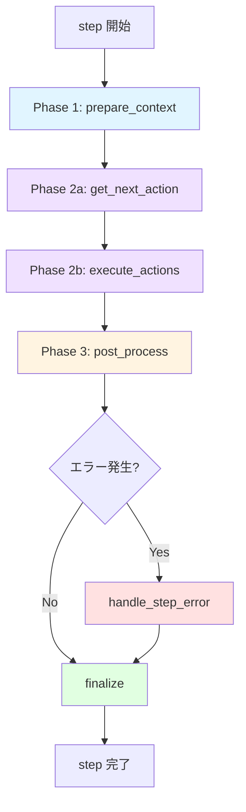
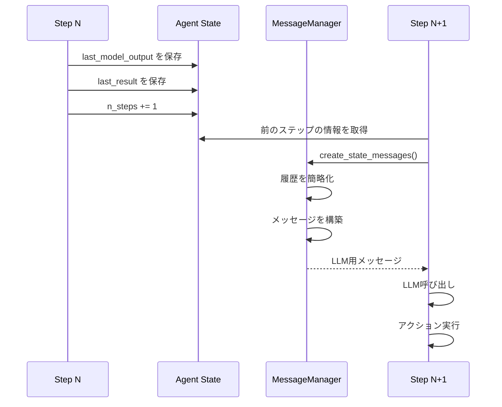

# ステップ処理の詳細解説

このドキュメントでは、Agent の最も重要な部分である「ステップ処理」について詳しく解説します。ステップ処理は、Agent が「考え」「行動し」「学習する」というサイクルの実装そのものです。

## 目次

- [概要](#概要)
- [ステップ処理の全体構造](#ステップ処理の全体構造)
- [Phase 1: コンテキスト準備](#phase-1-コンテキスト準備)
- [Phase 2: LLM思考とアクション実行](#phase-2-llm思考とアクション実行)
- [Phase 3: 後処理](#phase-3-後処理)
- [エラーハンドリング](#エラーハンドリング)
- [最終処理](#最終処理)
- [データフロー](#データフロー)
- [パフォーマンス最適化](#パフォーマンス最適化)
- [デバッグとトラブルシューティング](#デバッグとトラブルシューティング)
- [実装パターン](#実装パターン)

## 概要

### ステップとは？

**ステップ**は、Agent が目標達成に向けて実行する最小単位の処理サイクルです。人間に例えると：

1. **状況を観察する**（目で見る、情報を集める）
2. **考える**（何をすべきか判断する）
3. **行動する**（実際に手を動かす）
4. **結果を確認する**（うまくいったか確認）

これを1ステップとして、目標が達成されるまで繰り返します。

### なぜ重要なのか？

ステップ処理は：
- Agent の「知性」の大部分を担う
- パフォーマンスとコストに直結する
- デバッグの主な対象となる
- カスタマイズの主な対象となる

## ステップ処理の全体構造

### アーキテクチャ図



### コード構造

```python
async def step(self) -> None:
    """1ステップの実行"""
    self.step_start_time = time.time()

    try:
        # Phase 1: コンテキスト準備
        browser_state = await self._prepare_context(step_info)

        # Phase 2: LLM思考 + アクション実行
        await self._get_next_action(browser_state)
        await self._execute_actions()

        # Phase 3: 後処理
        await self._post_process()

    except Exception as e:
        # エラーハンドリング
        await self._handle_step_error(e)

    finally:
        # 最終処理（必ず実行）
        await self._finalize(browser_state)
```

### タイミング構造

```
┌─────────────────────── ステップ全体 ──────────────────────┐
│                                                             │
│  ┌─ prepare ─┐  ┌─ LLM ─┐  ┌─ exec ─┐  ┌─ post ─┐       │
│  │    5s     │  │  10s  │  │   3s   │  │   2s   │       │
│  └───────────┘  └───────┘  └────────┘  └────────┘       │
│                                                             │
│  ◄───────────── 約20秒 ─────────────►                     │
└─────────────────────────────────────────────────────────┘

典型的なステップの所要時間:
- 軽量なページ: 10-20秒
- 重いページ: 30-60秒
- 複雑なアクション: 60秒以上
```

## Phase 1: コンテキスト準備

**目的**: LLM が判断を下すために必要なすべての情報を収集・整理する

### 実行される処理

```python
async def _prepare_context(self, step_info: AgentStepInfo | None) -> BrowserStateSummary:
    """コンテキスト準備"""

    # 1. ブラウザ状態の取得
    browser_state = await self.browser_session.get_browser_state_summary(
        include_screenshot=True,      # 常にスクリーンショット取得
        include_recent_events=True    # 最近のイベント（クリック等）も取得
    )

    # 2. ダウンロード確認
    await self._check_and_update_downloads()

    # 3. 停止/一時停止の確認
    await self._check_stop_or_pause()

    # 4. アクションモデルの更新（ページ固有）
    await self._update_action_models_for_page(browser_state.url)

    # 5. メッセージの作成
    self._message_manager.create_state_messages(
        browser_state_summary=browser_state,
        model_output=self.state.last_model_output,
        result=self.state.last_result,
        use_vision=self.settings.use_vision,
        # ... その他のパラメータ
    )

    # 6. 最終ステップの強制処理
    await self._force_done_after_last_step(step_info)
    await self._force_done_after_failure()

    return browser_state
```

### 取得されるブラウザ状態

```python
@dataclass
class BrowserStateSummary:
    """ブラウザの現在の状態"""

    # 基本情報
    url: str                          # 現在のURL
    title: str                        # ページタイトル

    # DOM情報
    tabs: list[TabInfo]               # 開いているタブ
    interactable_elements: list[DOMElement]  # 操作可能な要素

    # 視覚情報
    screenshot: str | None            # Base64エンコードされた画像

    # イベント情報
    recent_events: list[BrowserEvent] # 最近のブラウザイベント

    # その他
    selector_map: dict[int, str]      # 要素インデックス→セレクタのマップ
```

### DOM要素の例

```python
# ブラウザから取得される要素情報
interactable_elements = [
    DOMElement(
        index=1,
        tag="button",
        text="検索",
        attributes={"class": "search-btn", "id": "search-button"},
        xpath="//button[@id='search-button']",
        is_visible=True,
        is_clickable=True
    ),
    DOMElement(
        index=2,
        tag="input",
        text="",
        attributes={"type": "text", "placeholder": "検索キーワード"},
        xpath="//input[@type='text']",
        is_visible=True,
        is_editable=True
    ),
    # ... 数百の要素
]
```

### メッセージの構築

```python
# LLMに送られるメッセージ構造
messages = [
    # システムプロンプト
    {
        "role": "system",
        "content": """あなたはブラウザ自動化エージェントです。
        タスクを達成するために、以下のアクションを使用できます：
        - navigate: URLに移動
        - click_element: 要素をクリック
        - type_text: テキストを入力
        ...（全アクションのリスト）
        """
    },

    # タスク説明
    {
        "role": "user",
        "content": f"タスク: {self.task}"
    },

    # 過去の履歴（簡略化）
    *history_messages,

    # 現在のブラウザ状態
    {
        "role": "user",
        "content": [
            {
                "type": "text",
                "text": f"""
                現在のページ: {browser_state.url}
                タイトル: {browser_state.title}

                操作可能な要素:
                [1] <button>検索</button>
                [2] <input type="text" placeholder="検索キーワード">
                [3] <a href="/about">About</a>
                ...

                利用可能なアクション: {page_specific_actions}
                """
            },
            {
                "type": "image_url",
                "image_url": {"url": f"data:image/png;base64,{screenshot}"}
            } if use_vision else None
        ]
    }
]
```

### 最適化のポイント

#### DOM の削減

```python
# 最適化前: 2000個の要素
all_elements = get_all_dom_elements()  # 200KB

# 最適化後: 50個の重要な要素のみ
filtered_elements = filter_interactable_elements(
    all_elements,
    max_elements=50,
    priority_tags=["button", "a", "input", "select"]
)  # 10KB - 20倍の削減！
```

#### トークン数の制御

```python
# 長いテキストを切り詰める
def truncate_text(text: str, max_length: int = 100) -> str:
    if len(text) <= max_length:
        return text
    return text[:max_length] + "..."

# DOM を簡略化
simplified_dom = simplify_dom_for_llm(
    browser_state.interactable_elements,
    max_tokens=2000  # 約2000トークンに制限
)
```

## Phase 2: LLM思考とアクション実行

この Phase は2つのサブフェーズに分かれます：

### Phase 2a: LLM呼び出し (`_get_next_action`)

**目的**: LLM に現在の状況を伝え、次に取るべきアクションを決定してもらう

```python
async def _get_next_action(self, browser_state: BrowserStateSummary) -> None:
    """LLMを呼び出して次のアクションを取得"""

    # 1. メッセージの取得
    input_messages = self._message_manager.get_messages()

    # 2. LLM呼び出し（タイムアウト付き）
    try:
        model_output = await asyncio.wait_for(
            self._get_model_output_with_retry(input_messages),
            timeout=self.settings.llm_timeout  # デフォルト: 120秒
        )
    except TimeoutError:
        raise TimeoutError(
            f"LLM呼び出しが {self.settings.llm_timeout} 秒でタイムアウトしました"
        )

    # 3. 出力の検証と保存
    self.state.last_model_output = model_output

    # 4. 再度停止確認
    await self._check_stop_or_pause()
```

#### リトライロジック

```python
async def _get_model_output_with_retry(
    self,
    messages: list[BaseMessage],
    max_retries: int = 3
) -> AgentOutput:
    """リトライ付きでLLMを呼び出す"""

    for attempt in range(max_retries):
        try:
            # LLM呼び出し
            response = await self.llm.ainvoke(messages)

            # 構造化出力にパース
            agent_output = self._parse_model_response(response)

            # 空の応答をチェック
            if not agent_output.action:
                if attempt < max_retries - 1:
                    continue  # リトライ
                else:
                    # 最後の試行: デフォルトアクションを返す
                    agent_output.action = [{"done": {"text": "No actions returned"}}]

            return agent_output

        except Exception as e:
            if attempt < max_retries - 1:
                await asyncio.sleep(2 ** attempt)  # 指数バックオフ
                continue
            raise
```

#### LLMの出力形式

```python
@dataclass
class AgentOutput:
    """LLMからの出力"""

    current_state: CurrentState  # 思考と要約
    action: list[ActionModel]    # 実行するアクション

@dataclass
class CurrentState:
    """現在の思考状態"""
    thought: str      # 「検索ボタンが見つかったのでクリックする」
    summary: str      # 「検索ページで検索準備中」

# 実際のLLM出力例
{
    "current_state": {
        "thought": "ユーザーが指定したキーワードで検索する必要がある。まず検索ボックスに入力し、次に検索ボタンをクリックする。",
        "summary": "検索キーワードを入力し、検索を実行する準備ができている"
    },
    "action": [
        {
            "type_text": {
                "index": 2,
                "text": "browser automation"
            }
        },
        {
            "click_element": {
                "index": 1
            }
        }
    ]
}
```

### Phase 2b: アクション実行 (`_execute_actions`)

**目的**: LLMが決定したアクションを実際にブラウザで実行する

```python
async def _execute_actions(self) -> None:
    """アクションの実行"""

    if not self.state.last_model_output:
        raise ValueError("実行するアクションがありません")

    # アクションを順次実行
    result = await self.multi_act(self.state.last_model_output.action)

    # 結果を保存
    self.state.last_result = result
```

#### multi_act の内部動作

```python
async def multi_act(self, actions: list[ActionModel]) -> list[ActionResult]:
    """複数のアクションを順次実行"""
    results = []

    for i, action in enumerate(actions):
        try:
            # 1. アクション名を取得（"click_element", "type_text" 等）
            action_name = action.model_dump().keys()[0]
            action_params = action.model_dump()[action_name]

            # 2. ツールレジストリから対応する関数を取得
            tool_func = self.tools.registry.get_tool(action_name)

            # 3. アクションを実行
            result = await tool_func(**action_params)

            # 4. 結果を記録
            results.append(ActionResult(
                success=True,
                extracted_content=result.content,
                error=None
            ))

            # 5. done アクションなら即座に終了
            if action_name == "done":
                break

        except Exception as e:
            # エラーを記録して継続
            results.append(ActionResult(
                success=False,
                extracted_content=None,
                error=str(e)
            ))

            # 致命的なエラーなら中断
            if is_fatal_error(e):
                break

    return results
```

#### 具体的なアクション実行例

```python
# 例1: click_element の実行
async def click_element(self, index: int) -> ActionResult:
    """要素をクリック"""

    # 1. インデックスからセレクタを取得
    selector = self.selector_map[index]

    # 2. CDP経由でクリック
    await self.browser_session.page.click(selector)

    # 3. ページの安定を待つ
    await self.browser_session.page.wait_for_load_state("domcontentloaded")

    # 4. 結果を返す
    return ActionResult(
        success=True,
        extracted_content=f"要素 {index} をクリックしました"
    )

# 例2: type_text の実行
async def type_text(self, index: int, text: str) -> ActionResult:
    """テキストを入力"""

    selector = self.selector_map[index]

    # 既存のテキストをクリア
    await self.browser_session.page.fill(selector, "")

    # 新しいテキストを入力（人間らしい速度で）
    await self.browser_session.page.type(selector, text, delay=50)

    return ActionResult(
        success=True,
        extracted_content=f"'{text}' を入力しました"
    )
```

#### ActionResult の構造

```python
@dataclass
class ActionResult:
    """アクション実行の結果"""

    success: bool                    # 成功したか
    extracted_content: str | None    # 抽出されたコンテンツ
    error: str | None                # エラーメッセージ
    is_done: bool                    # タスク完了か
    attachments: list[str]           # 添付ファイルパス

    # 例: 成功した検索
    ActionResult(
        success=True,
        extracted_content="検索結果が50件見つかりました",
        error=None,
        is_done=False,
        attachments=[]
    )

    # 例: タスク完了
    ActionResult(
        success=True,
        extracted_content="タスクが完了しました。検索結果のスクリーンショットを保存しました。",
        error=None,
        is_done=True,
        attachments=["screenshot.png"]
    )

    # 例: エラー
    ActionResult(
        success=False,
        extracted_content=None,
        error="要素が見つかりませんでした: button[id='search']",
        is_done=False,
        attachments=[]
    )
```

## Phase 3: 後処理

**目的**: アクション実行後の状態を確認し、記録する

```python
async def _post_process(self) -> None:
    """後処理"""

    # 1. ダウンロードの確認
    await self._check_and_update_downloads('after executing actions')

    # 2. 失敗のチェック
    if self.state.last_result and len(self.state.last_result) == 1:
        if self.state.last_result[-1].error:
            # 連続失敗をカウント
            self.state.consecutive_failures += 1
            return

    # 3. 成功時は失敗カウンタをリセット
    self.state.consecutive_failures = 0

    # 4. done アクションの結果をログ出力
    if self.state.last_result and self.state.last_result[-1].is_done:
        success = self.state.last_result[-1].success
        content = self.state.last_result[-1].extracted_content

        if success:
            logger.info(f"✅ 最終結果: {content}")
        else:
            logger.info(f"❌ 最終結果: {content}")

        # 添付ファイルも表示
        for attachment in self.state.last_result[-1].attachments:
            logger.info(f"📎 添付: {attachment}")
```

### ダウンロードの追跡

```python
async def _check_and_update_downloads(self, context: str) -> None:
    """新しいダウンロードを確認して記録"""

    # ブラウザからダウンロードリストを取得
    downloads = await self.browser_session.get_downloads()

    # 新しいダウンロードをフィルタ
    new_downloads = [
        d for d in downloads
        if d.path not in self.tracked_downloads
    ]

    if new_downloads:
        for download in new_downloads:
            logger.info(f"📥 新しいダウンロード: {download.path}")

            # available_file_paths に追加
            self.available_file_paths.append(download.path)
            self.tracked_downloads.add(download.path)

        # 次のステップでLLMに伝える
        self._message_manager.add_download_notification(new_downloads)
```

## エラーハンドリング

**目的**: 予期しないエラーを適切に処理し、可能な限り続行する

```python
async def _handle_step_error(self, error: Exception) -> None:
    """エラーハンドリング"""

    # 1. 特殊なエラー: ユーザーによる中断
    if isinstance(error, InterruptedError):
        logger.error("エージェントが中断されました")
        return

    # 2. エラーメッセージのフォーマット
    include_trace = logger.isEnabledFor(logging.DEBUG)
    error_msg = AgentError.format_error(error, include_trace)

    # 3. 失敗カウンタを増やす
    self.state.consecutive_failures += 1

    # 4. ログ出力
    logger.error(
        f"❌ 失敗 {self.state.consecutive_failures}/"
        f"{self.settings.max_failures}: {error_msg}"
    )

    # 5. エラーを結果として保存（次のステップでLLMに伝わる）
    self.state.last_result = [ActionResult(error=error_msg)]
```

### エラーの種類と対処

```python
# 1. パースエラー（LLMの出力が不正）
if "Could not parse response" in error_msg:
    # ヒント: 出力形式の例を追加
    hint_message = """
    正しい出力形式:
    {
        "current_state": {"thought": "...", "summary": "..."},
        "action": [{"click_element": {"index": 1}}]
    }
    """
    self._message_manager.add_hint(hint_message)

# 2. 要素が見つからない
if "Element not found" in error_msg:
    # 次回: より詳細なDOMを送る、またはスクリーンショットを強制
    self.force_detailed_dom_next_step = True

# 3. タイムアウト
if "TimeoutError" in error_msg:
    # 次回: より長いタイムアウトを設定
    self.settings.action_timeout *= 1.5
```

### 失敗時の自動リトライ

```python
# 連続失敗が閾値を超えたら
if self.state.consecutive_failures > self.settings.max_failures:

    # 最終的な応答を試みる
    if self.settings.final_response_after_failure:
        logger.info("最大失敗回数に達しました。最終応答を試みます...")

        # done アクションを強制
        self.AgentOutput = self.DoneAgentOutput

        # 失敗を明示するメッセージを追加
        self._message_manager.add_failure_notice(
            f"{self.settings.max_failures}回失敗しました。"
            "現時点での結果をまとめてください。"
        )
    else:
        # 即座に終了
        raise AgentError(
            f"最大失敗回数 {self.settings.max_failures} を超えました"
        )
```

## 最終処理

**目的**: ステップの結果を記録し、履歴を更新する（必ず実行される）

```python
async def _finalize(self, browser_state: BrowserStateSummary | None) -> None:
    """最終処理（finally block で必ず実行）"""

    step_end_time = time.time()

    if not self.state.last_result:
        return  # 結果がない場合は何もしない

    if browser_state:
        # 1. メタデータの作成
        metadata = StepMetadata(
            step_number=self.state.n_steps,
            step_start_time=self.step_start_time,
            step_end_time=step_end_time,
        )

        # 2. 履歴アイテムの作成
        await self._make_history_item(
            self.state.last_model_output,
            browser_state,
            self.state.last_result,
            metadata,
            state_message=self._message_manager.last_state_message_text,
        )

    # 3. ステップ完了のログ
    self._log_step_completion_summary(
        self.step_start_time,
        self.state.last_result
    )

    # 4. ファイルシステムの保存
    self.save_file_system_state()

    # 5. イベント送信（クラウド同期）
    if self.enable_cloud_sync and browser_state:
        step_event = CreateAgentStepEvent.from_agent_step(
            self,
            self.state.last_model_output,
            self.state.last_result,
            actions_data,
            browser_state,
        )
        self.eventbus.dispatch(step_event)

    # 6. ステップカウンタを増やす
    self.state.n_steps += 1
```

### 履歴アイテムの構造

```python
@dataclass
class AgentHistory:
    """1ステップの履歴"""

    # ステップ情報
    step_number: int
    timestamp: datetime

    # 状態
    url: str
    title: str
    screenshot: str | None

    # 思考と行動
    model_output: AgentOutput       # LLMの出力
    actions: list[ActionModel]      # 実行されたアクション
    results: list[ActionResult]     # アクション結果

    # メタデータ
    execution_time: float           # 実行時間（秒）
    tokens_used: int                # 使用トークン数
    cost: float                     # 推定コスト（USD）

# 履歴の例
history = AgentHistory(
    step_number=5,
    timestamp=datetime.now(),
    url="https://example.com/search",
    title="Search Results",
    screenshot="base64...",
    model_output=AgentOutput(...),
    actions=[
        {"click_element": {"index": 1}},
        {"type_text": {"index": 2, "text": "query"}}
    ],
    results=[
        ActionResult(success=True, ...),
        ActionResult(success=True, ...)
    ],
    execution_time=15.3,
    tokens_used=4500,
    cost=0.02
)
```

## データフロー

### ステップ間のデータ伝播



### ステート管理

```python
@dataclass
class AgentState:
    """Agent の状態"""

    # ステップ情報
    n_steps: int = 0                    # 現在のステップ数
    consecutive_failures: int = 0       # 連続失敗回数

    # 最後のステップの情報
    last_model_output: AgentOutput | None = None
    last_result: list[ActionResult] | None = None

    # フラグ
    is_paused: bool = False
    is_stopped: bool = False
    should_force_done: bool = False

# ステップ間での状態遷移
# Step 1
state.last_model_output = output1
state.last_result = result1
state.n_steps = 1

# Step 2（Step 1の結果を参照）
messages = create_messages(
    previous_output=state.last_model_output,  # Step 1の思考
    previous_result=state.last_result,        # Step 1の結果
)
state.last_model_output = output2
state.last_result = result2
state.n_steps = 2
```

### メッセージ履歴の管理

```python
class MessageManager:
    """LLMに送るメッセージを管理"""

    def __init__(self, max_history_messages: int = 10):
        self.max_history = max_history_messages
        self.messages: list[BaseMessage] = []

    def create_state_messages(
        self,
        browser_state: BrowserStateSummary,
        model_output: AgentOutput | None,
        result: list[ActionResult] | None,
        **kwargs
    ):
        """現在のステップのメッセージを作成"""

        # 1. 前のステップの結果を追加
        if model_output and result:
            # 思考
            self.messages.append(AIMessage(
                content=f"思考: {model_output.current_state.thought}"
            ))

            # アクション
            self.messages.append(AIMessage(
                content=f"アクション: {model_output.action}"
            ))

            # 結果
            self.messages.append(UserMessage(
                content=f"結果: {result}"
            ))

        # 2. 現在のブラウザ状態を追加
        state_message = self._format_browser_state(browser_state, **kwargs)
        self.messages.append(UserMessage(content=state_message))

        # 3. 履歴が長すぎる場合は古いものを削除
        if len(self.messages) > self.max_history:
            # システムプロンプト + 最新のN件を保持
            self.messages = (
                self.messages[:1] +  # システムプロンプト
                self.messages[-(self.max_history - 1):]  # 最新N-1件
            )
```

## パフォーマンス最適化

### 1. トークン数の削減

```python
# ❌ 最適化前: 10,000トークン
all_elements = get_all_elements()  # 2000個の要素

# ✅ 最適化後: 2,000トークン
filtered_elements = filter_elements(
    all_elements,
    max_elements=50,
    remove_invisible=True,
    remove_non_interactive=True
)
```

### 2. ビジョンモードの条件付き使用

```python
# 視覚情報が必要な時だけ使用
use_vision = (
    self.settings.use_vision and
    (
        # フォームページ
        "form" in browser_state.url.lower() or
        # エラーページ
        "error" in browser_state.title.lower() or
        # 連続失敗時
        self.state.consecutive_failures > 2
    )
)

browser_state = await self.browser_session.get_browser_state_summary(
    include_screenshot=use_vision
)
```

### 3. 並列実行

```python
# ❌ 順次実行: 遅い
browser_state = await get_browser_state()  # 2秒
await check_downloads()                     # 1秒
await update_models()                       # 1秒
# 合計: 4秒

# ✅ 並列実行: 速い
results = await asyncio.gather(
    get_browser_state(),
    check_downloads(),
    update_models()
)
browser_state, _, _ = results
# 合計: 2秒（最も遅い処理の時間）
```

### 4. キャッシング

```python
class ActionModelCache:
    """アクションモデルのキャッシュ"""

    def __init__(self):
        self.cache: dict[str, list[ActionModel]] = {}

    async def get_models_for_url(self, url: str) -> list[ActionModel]:
        """URLに応じたアクションモデルを取得（キャッシュ付き）"""

        # ドメイン単位でキャッシュ
        domain = extract_domain(url)

        if domain in self.cache:
            return self.cache[domain]

        # キャッシュにない場合は計算
        models = await self._compute_models(url)
        self.cache[domain] = models

        return models
```

### 5. 早期終了

```python
# done アクションが見つかったら即座に終了
for i, action in enumerate(actions):
    result = await execute_action(action)
    results.append(result)

    # done なら残りのアクションをスキップ
    if action.get("done"):
        logger.info(f"Done action detected, skipping {len(actions) - i - 1} remaining actions")
        break
```

## デバッグとトラブルシューティング

### ログレベルの設定

```bash
# 詳細ログを有効化
export BROWSER_USE_LOGGING_LEVEL=debug
python script.py
```

```python
# コード内で設定
import logging
logger = logging.getLogger('browser_use')
logger.setLevel(logging.DEBUG)

# ステップごとのログ
logger.debug(f"Step {n}: Browser state obtained")
logger.debug(f"Step {n}: LLM called with {len(messages)} messages")
logger.debug(f"Step {n}: Executing {len(actions)} actions")
```

### ステップのタイミング分析

```python
# 各フェーズの実行時間を計測
@dataclass
class StepTiming:
    prepare_context: float
    llm_call: float
    execute_actions: float
    post_process: float
    finalize: float

    @property
    def total(self) -> float:
        return sum([
            self.prepare_context,
            self.llm_call,
            self.execute_actions,
            self.post_process,
            self.finalize
        ])

# 使用例
timing = StepTiming(
    prepare_context=5.2,
    llm_call=12.3,
    execute_actions=3.1,
    post_process=0.8,
    finalize=1.2
)

print(f"Total: {timing.total:.1f}s")
print(f"LLM: {timing.llm_call / timing.total * 100:.1f}%")
```

### よくある問題のデバッグ

#### 問題1: ステップが遅い

```python
# 原因を特定
async def profile_step():
    with Profiler() as prof:
        await agent.step()

    prof.print_stats()
    # 出力例:
    # prepare_context: 15.2s ← 問題！
    # - get_browser_state: 14.8s ← DOM取得が遅い
    # llm_call: 8.1s
    # execute_actions: 2.3s

# 解決策: DOMフィルタリングを強化
agent.settings.max_dom_elements = 30  # デフォルト: 50
```

#### 問題2: LLMが間違ったアクションを選択

```python
# デバッグ: LLMに送られたメッセージを確認
messages = agent._message_manager.get_messages()

# ファイルに保存
with open("debug_messages.json", "w") as f:
    json.dump([msg.dict() for msg in messages], f, indent=2)

# 確認ポイント:
# 1. DOM情報が正確か？
# 2. 過去の履歴が適切に要約されているか？
# 3. スクリーンショットが含まれているか？
# 4. アクションの説明が明確か？
```

#### 問題3: アクションが失敗する

```python
# エラーの詳細をログ
logger.setLevel(logging.DEBUG)

# 典型的なエラー:
# 1. "Element not found" → セレクタが正しくない
#    解決: より安定したセレクタ戦略を使用
# 2. "Timeout" → ページ読み込みが遅い
#    解決: タイムアウトを増やす
# 3. "Element not clickable" → 要素が覆われている
#    解決: scroll_into_view を使用
```

## 実装パターン

### パターン1: 条件付きアクション

```python
# LLMに条件分岐をさせる
task = """
1. ログインページに移動
2. もしログイン済みなら→ダッシュボードに移動
3. もし未ログインなら→ログインフォームに入力
"""

# Agent は自動的に条件を判断
result = agent.run_sync()
```

### パターン2: ループ処理

```python
task = """
以下を検索結果がなくなるまで繰り返す:
1. 現在のページのリンクを抽出
2. 次のページに移動
"""

# max_steps で制御
agent = Agent(
    task=task,
    llm=llm,
    max_steps=50  # 最大50ページまで
)
```

### パターン3: データ収集

```python
task = """
1. 商品一覧ページに移動
2. 最初の10個の商品について:
   - 商品名
   - 価格
   - レビュー評価
   を抽出してJSONで返す
"""

result = agent.run_sync()
products = json.loads(result.extracted_content)
```

### パターン4: エラーリカバリ

```python
# カスタムエラーハンドラ
class ResilientAgent(Agent):
    async def _handle_step_error(self, error: Exception) -> None:
        """カスタムエラーハンドリング"""

        # 特定のエラーに対する特別な処理
        if "rate limit" in str(error).lower():
            logger.info("Rate limit detected, waiting 60s...")
            await asyncio.sleep(60)
            # エラーをクリアして続行
            self.state.last_result = None
            return

        # その他は通常処理
        await super()._handle_step_error(error)
```

## まとめ

### ステップ処理の本質

ステップ処理は、以下の4つの質問に答え続けるループです：

1. **What?** - 今どういう状況か？（`_prepare_context`）
2. **Why?** - なぜその状況なのか？（LLMの思考）
3. **How?** - 何をすべきか？（`_get_next_action`）
4. **Result?** - どうなったか？（`_execute_actions`, `_post_process`）

### ベストプラクティス

1. **トークンを節約** - DOMフィルタリング、履歴管理
2. **タイムアウトを設定** - 無限ループを防ぐ
3. **ログを活用** - デバッグの鍵
4. **ビジョンモードは必要時のみ** - コストとパフォーマンス
5. **エラーを想定** - リトライとフォールバック

### 関連ドキュメント

- [agent_flow.md](./agent_flow.md) - Agent全体のフロー
- [README.md](./README.md) - Agent概要
- [BrowserSession](../browser/session.md) - ブラウザ制御
- [Tools](../tools/README.md) - アクションシステム

---

**最終更新**: 2025年10月14日
**対応バージョン**: browser-use 0.8.0
